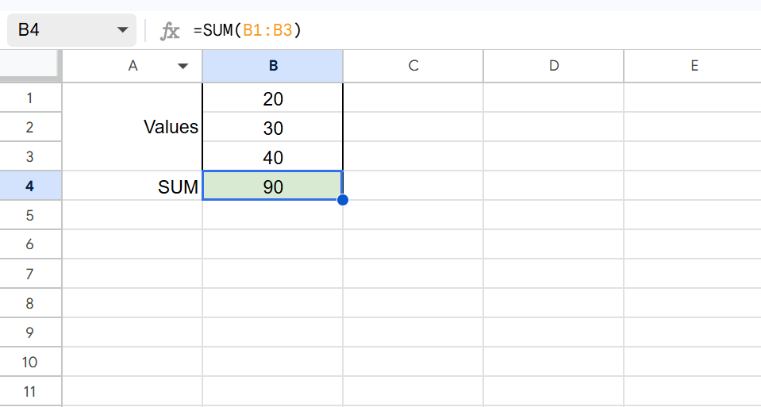
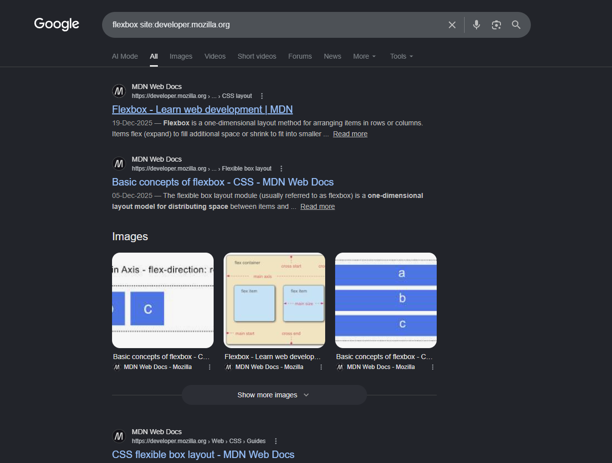

# 0.2 Word, Excel, and Google for developers

Before you write a single line of code, a handful of everyday office tools will
save you hours every week. You have heard of all of them. You may not have used
them the way a working professional does. Let us fix that, and let us do it for
free.

## What you'll know by the end

- How to use Word, Excel, and PowerPoint free in your browser, and the Google tools that match them
- How to write, format, and save a document, and what real documents like contracts are for
- How to write a first developer CV, honestly
- How to add up numbers in a spreadsheet, the same way a business runs its accounts
- How to search Google the way developers do

---

## Two free ways to use these tools

You do not need to buy anything. Both Microsoft and Google give you these tools
free, inside your browser, with your work saved automatically to the **cloud**
(Roman Urdu: internet par save, jise tum kisi bhi device se khol sakte ho).

- **Microsoft Office on the web.** Go to [office.com](https://www.office.com) and sign in with a free Microsoft account. You get Word, Excel, and PowerPoint in the browser, with nothing to install. It runs in Microsoft Edge, Chrome, or any browser.
- **Google's tools**, which people call Google files. [Google Docs](https://docs.google.com) for documents, [Google Sheets](https://sheets.google.com) for spreadsheets, and [Google Slides](https://slides.google.com) for slideshows, the same job as PowerPoint. Sign in with a Google account.

Both save as you type and open from any computer or phone. Pick whichever you
like. The ideas are the same in both, so this lesson uses them together.

| The job | Microsoft | Google |
| --- | --- | --- |
| Documents | Word | Google Docs |
| Spreadsheets | Excel | Google Sheets |
| Slideshows | PowerPoint | Google Slides |

---

## Documents that mean business

A document is a page of text you can style, save, and send. Beyond simple notes,
professionals run real business on documents:

- Letters, applications, and reports.
- **Contracts** (Roman Urdu: likhit samjhauta jise dono taraf maante hain). An employee contract sets the salary, hours, and duties. A company contract sets what each side must deliver, by when, and who is responsible if something goes wrong. Those responsibilities are the **liabilities** (Roman Urdu: woh zimmedariyan jin ka hisaab dena padta hai).

Writing things down clearly, and keeping a copy, protects everyone. A spoken
promise is easy to forget. A written, signed one is not. As a freelancer later,
a simple written agreement will save you from many arguments.

To make a document and save it:

1. Open [Google Docs](https://docs.google.com), or [office.com](https://www.office.com) for Word, and sign in.
2. Click the blank page, type a few lines, then select text and make it bold, bigger, or a new colour.
3. Save a Word copy with **File > Download > Microsoft Word (.docx)**, or a PDF copy for sending.

A `.docx` file can still be edited. A `.pdf` looks the same on every phone and
laptop, so when you send finished work, send the PDF.

!!! tip "Keep a notes document"
    Keep a notes document open while you study. Write three lines after each
    lesson in your own words. Future you will thank present you.

!!! info "Watch how the pros use it"
    See how people build real documents and contracts in Word. Search YouTube
    for [creating a contract in Microsoft Word](https://www.youtube.com/results?search_query=create+a+contract+in+microsoft+word)
    and watch how they set out the terms, the parties, and the signature lines.

### Make your CV

Your **CV** (Roman Urdu: tumhara taaruf naama jo tumhara kaam aur hunar batata
hai), also called a resume, is the one document that gets you hired. As a
front-end developer, a clean one-page CV beats a long fancy one. Include:

- Your name and the role you want, like "Front-End Developer".
- Contact: email, phone, and your city.
- Links that prove your work: your GitHub, your portfolio website, and your LinkedIn.
- A two-line summary of who you are.
- Skills: HTML, CSS, JavaScript, React, Tailwind, Git.
- **Projects**, two or three, each with one line plus a live link and the code link. For a junior developer, real projects matter more than anything else on the page.
- Education and courses, including this Bano Qabil course.

!!! note "Sidq: keep your CV honest"
    Only put real skills and real projects on your CV. A CV that claims what you
    cannot do falls apart in the first interview or the first task you are given.
    Honesty here is not only right, it is the smart long game. Your GitHub and
    your live links are the proof that backs up every line.

You will build the real, polished version in Chapter 20. For now, a first draft
is enough.

!!! info "Templates and a walkthrough"
    Start from a free template at [Microsoft Create resume templates](https://create.microsoft.com/en-us/templates/resumes),
    and search YouTube for [a software developer CV tutorial](https://www.youtube.com/results?search_query=software+developer+cv+resume+tutorial)
    to see what a strong junior CV looks like.

### Try this

Open a new document and write the first draft of your CV using the list above.
Leave the projects section as a heading with the words "coming soon". You will
fill it with real projects as you build them through this course. Save it as a
PDF so it is ready to share.

---

## Spreadsheets: how a business counts its money

A spreadsheet is a grid of boxes called cells. Each cell has an address like
`A1` or `B2`. The useful part is that a cell can hold a formula, and the sheet
does the maths for you.

A formula always starts with `=`. That is how the sheet knows you want a
calculation, not plain text.

Before the formulas make sense, you need the address system. Columns are letters
across the top (`A`, `B`, `C`), rows are numbers down the side (`1`, `2`, `3`).
So `B1` means the box in column B, row 1. When you see a colon, like `B1:B3`,
that is a **range**: every cell from `B1` down to `B3`. So `=SUM(B1:B3)` adds
three boxes, B1, B2, and B3, together.

Try these in [Google Sheets](https://sheets.google.com) or Excel:

```text
=SUM(B1:B3)             adds the numbers from B1 down to B3
=AVERAGE(B1:B3)         finds the average of those numbers
=COUNTIF(B1:B3,">50")   counts how many of them are greater than 50
```



This is exactly how a small business runs its money. An accountant tracks every
sale and every expense in a sheet, adds up the month's income, subtracts the
costs, and sees the profit. A whole company's accounts can live in one
well-built spreadsheet: salaries, bills, sales, and totals that update the
moment a single number changes. That is the real power, and it starts with the
same three formulas you just typed.

!!! info "Watch how the pros use it"
    See how accountants and finance professionals run real books in Excel.
    Search YouTube for [Excel for accounting, full course](https://www.youtube.com/results?search_query=excel+for+accounting+full+course),
    and keep [the Microsoft Excel functions list](https://support.microsoft.com/excel)
    handy as a reference.

### Try this

Make a small marks sheet. In column A type three subject names (Maths, English,
Urdu) down rows 1 to 3. In column B type a mark out of 100 next to each. Then in
cell `B4` type `=AVERAGE(B1:B3)` and press Enter. The sheet gives you the class
average at once. Change one mark and watch `B4` update on its own. That instant
recalculation is the whole point of a spreadsheet.

> **Did you know**
>
> The first spreadsheet program, VisiCalc, came out in 1979. People bought
> whole computers just to run it. A good idea, clearly explained, sells itself.

---

## Search Google like a developer

Most coding problems are already solved somewhere online. The real skill is
finding the answer fast. These four tricks do most of the work.

- **Quotes** find an exact phrase: `"center a div"` keeps those words together.
- **`site:`** searches one website only: `flexbox site:developer.mozilla.org`.
- **Minus** removes a word: `jaguar speed -car` hides the car results.
- **Add the year** for fresh answers: `best way to center css 2025`.



> **Tip: read more than the first result**
>
> The top result is not always the best. Open two or three. Prefer MDN and
> web.dev. You will meet both many times in this course.

---

## Knowledge check

Don't write anything down. Just see if you can answer these in your head. If you
can't, scroll back up. That's exactly what this section is for.

1. Which Google tool does the same job as Microsoft Word? And the one for Excel?
2. What is the difference between a `.docx` and a PDF, and which do you send?
3. On a developer's CV, what actually proves your skills are real?
4. What does every spreadsheet formula start with?
5. How would you search for "flexbox" only on the MDN website?

---

## What's next

You can now write, calculate, and search like a developer, and you have a first
CV started. Next you'll meet a study partner that never gets tired of your
questions: AI tools like ChatGPT and Claude, and how to use them without fooling
yourself.

[Next: 0.2.1 Build your CV &rarr;](0-2-1-cv-assignment.md){ .next-lesson }

---

## Going deeper (optional)

These are for the curious. You don't need them to continue.

- Microsoft: [Word help and learning](https://support.microsoft.com/word) a clear official starting point.
- Microsoft: [Excel functions list](https://support.microsoft.com/excel) every function with examples.
- Google: [Refine web searches with operators](https://support.google.com/websearch/answer/2466433) the full list of search tricks.

---

<!-- The Mark Complete button is injected here automatically by the site template. -->

<!-- Glossary tooltips used in this lesson. -->
*[cloud]: Files saved on the internet instead of only on your computer, so you can open them from any device. (Roman Urdu: internet par save files jo har device se khulti hain)
*[document]: A page of text you can style, save, and share, made in Word or Google Docs. (Roman Urdu: text wala page jo Word ya Google Docs mein banta hai)
*[contract]: A written agreement that both sides accept, setting out who must do what. (Roman Urdu: likhit samjhauta jise dono taraf maante hain)
*[CV]: A short document listing your skills, projects, and experience, used to get hired. Also called a resume. (Roman Urdu: taaruf naama jo kaam aur hunar batata hai)
*[spreadsheet]: A grid of cells for numbers and calculations, like Google Sheets or Excel. (Roman Urdu: ek table jis mein numbers aur hisaab hota hai)
*[cell]: One box in a spreadsheet, named by its column and row, like B2. (Roman Urdu: spreadsheet ka ek khaana, jaise B2)
*[formula]: An instruction in a cell that calculates a result. It always starts with an equals sign. (Roman Urdu: cell mein likhi hidayat jo hisaab karti hai)
*[PDF]: A file format that looks the same on every device. Good for sending finished work. (Roman Urdu: aisi file jo har device par same dikhti hai)
