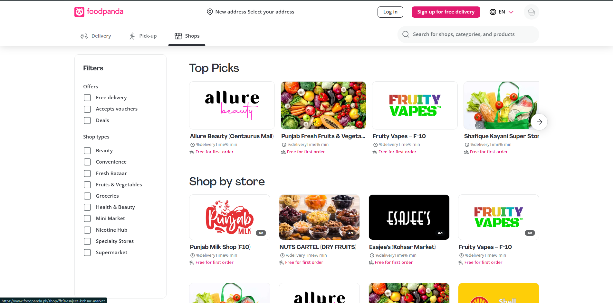
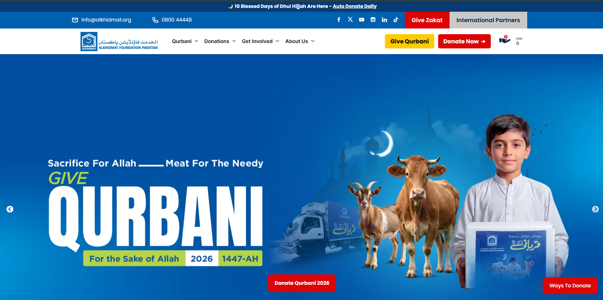
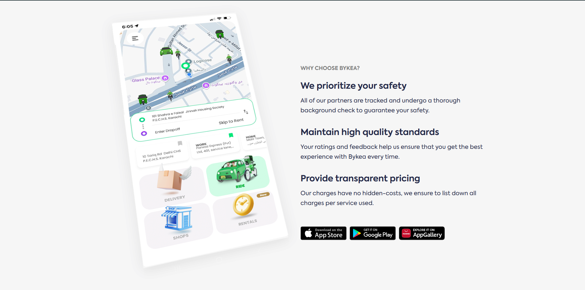

# 1.1 What is frontend development?

Open any website you like. The buttons, the menus, the photos, the colours: that
is the front of the web. Someone wrote code to make all of it. By the end of this
course, that someone is you. This lesson explains what that work is called and
what you can build with it.

## What you'll know by the end

- What frontend means, in plain words
- How frontend differs from backend and full-stack
- The kinds of websites you can build
- Real Pakistani sites you already use as examples
- A simple intention to start with

---

## Frontend, backend, full-stack

A website has two halves. There is the part you see and touch, and the part that
works behind the scenes.

The **frontend** is the part users see and click, right inside the browser. The
text, the layout, the buttons, the form you fill in: all frontend. You build it
with HTML, CSS, and JavaScript. This is what this whole course teaches.

The **backend** is the part users never see. It runs on a server far away. It
saves your account, checks your password, and remembers what is in your cart. It
sends the right data to the frontend.

A **full-stack** developer does both halves. They build the part you see and the
part behind it. Many people start with frontend, then learn backend later.

Think of a restaurant. The frontend is the dining hall, the menu, and the waiter.
The backend is the kitchen. The full-stack person can serve a table and cook the
food.

<figure markdown>
<svg viewBox="0 0 820 300" xmlns="http://www.w3.org/2000/svg" role="img" aria-labelledby="svg-fbf-title" style="max-width:100%;height:auto">
  <title id="svg-fbf-title">Frontend is the part you see in the browser; backend runs on a server behind the scenes; a full-stack developer builds both.</title>
  <defs>
    <marker id="fbf-arrow" viewBox="0 0 10 10" refX="9" refY="5" markerWidth="7" markerHeight="7" orient="auto-start-reverse"><path d="M0 0 L10 5 L0 10 z" fill="currentColor"/></marker>
  </defs>
  <g fill="#ffffff" stroke="#1f1f1c" stroke-width="1.5">
    <rect x="30" y="50" width="300" height="150" rx="12"/>
    <rect x="490" y="50" width="300" height="150" rx="12"/>
  </g>
  <g fill="#6b6b65" stroke="none">
    <circle cx="52" cy="72" r="5"/>
    <circle cx="70" cy="72" r="5"/>
    <circle cx="88" cy="72" r="5"/>
    <circle cx="575" cy="116" r="4"/>
    <circle cx="575" cy="146" r="4"/>
    <circle cx="575" cy="176" r="4"/>
  </g>
  <g fill="none" stroke="#1f1f1c" stroke-width="1.5">
    <line x1="30" y1="90" x2="330" y2="90"/>
    <line x1="490" y1="90" x2="790" y2="90"/>
    <rect x="560" y="105" width="160" height="22" rx="4"/>
    <rect x="560" y="135" width="160" height="22" rx="4"/>
    <rect x="560" y="165" width="160" height="22" rx="4"/>
  </g>
  <g fill="#1f1f1c" stroke="none">
    <rect x="55" y="110" width="160" height="14" rx="3"/>
    <rect x="55" y="135" width="240" height="10" rx="3" fill="#6b6b65"/>
    <rect x="55" y="158" width="90" height="26" rx="6"/>
  </g>
  <g fill="none" stroke="currentColor" stroke-width="2">
    <line x1="340" y1="105" x2="478" y2="105" marker-end="url(#fbf-arrow)"/>
    <line x1="480" y1="150" x2="342" y2="150" marker-end="url(#fbf-arrow)"/>
  </g>
  <g fill="none" stroke="#6b6b65" stroke-width="1.5">
    <path d="M30 250 L30 235 L790 235 L790 250"/>
  </g>
  <g font-family="Inter, sans-serif" text-anchor="middle">
    <text x="180" y="40" font-size="17" font-weight="600" fill="#1f1f1c">Frontend</text>
    <text x="640" y="40" font-size="17" font-weight="600" fill="#1f1f1c">Backend</text>
    <text x="410" y="98" font-size="12" fill="#6b6b65">asks for data</text>
    <text x="410" y="168" font-size="12" fill="#6b6b65">sends data back</text>
    <text x="180" y="223" font-size="12.5" fill="#6b6b65">what you see and click (the dining hall)</text>
    <text x="640" y="223" font-size="12.5" fill="#6b6b65">runs on a server (the kitchen)</text>
    <text x="410" y="278" font-size="14" font-weight="600" fill="#1f1f1c">A full-stack developer builds both halves</text>
  </g>
</svg>
<figcaption>Frontend lives in the browser, backend lives on a server, and full-stack means building both.</figcaption>
</figure>

??? note urdu "اردو میں مزید وضاحت"
    ویب سائٹ کے دو حصے ہوتے ہیں۔ فرنٹ اینڈ وہ حصہ ہے جو آپ براؤزر میں دیکھتے اور
    کلک کرتے ہیں، جیسے بٹن، مینو، اور فارم۔ بیک اینڈ وہ حصہ ہے جو پیچھے سرور پر چلتا
    ہے اور ڈیٹا سنبھالتا ہے۔ فل اسٹیک ڈیولپر دونوں حصے بناتا ہے۔ یہ کورس آپ کو فرنٹ
    اینڈ سکھاتا ہے۔

<figure markdown>
<svg viewBox="0 0 800 220" xmlns="http://www.w3.org/2000/svg" role="img" aria-labelledby="svg-flow-title" style="max-width:100%;height:auto">
  <title id="svg-flow-title">How your work reaches a person: you write code, the browser reads it, and a person sees a website.</title>
  <!-- three panels -->
  <g fill="#ffffff" stroke="#1f1f1c" stroke-width="1.5">
    <rect x="20" y="55" width="200" height="90" rx="10"/>
    <rect x="300" y="55" width="200" height="90" rx="10"/>
    <rect x="580" y="55" width="200" height="90" rx="10"/>
  </g>
  <g fill="#1f1f1c" font-family="Inter, sans-serif" font-size="17" text-anchor="middle">
    <text x="120" y="98" font-weight="600">You write code</text>
    <text x="120" y="120" font-size="13" fill="#6b6b65">HTML, CSS, JS</text>
    <text x="400" y="98" font-weight="600">The browser reads it</text>
    <text x="400" y="120" font-size="13" fill="#6b6b65">Chrome, Edge</text>
    <text x="680" y="98" font-weight="600">A person sees</text>
    <text x="680" y="120" font-size="13" fill="#6b6b65">a website</text>
  </g>
  <!-- arrows use currentColor so they adapt to light and dark -->
  <defs>
    <marker id="bq-arrow-flow" viewBox="0 0 10 10" refX="9" refY="5" markerWidth="7" markerHeight="7" orient="auto-start-reverse">
      <path d="M0 0 L10 5 L0 10 z" fill="currentColor"/>
    </marker>
  </defs>
  <g stroke="currentColor" stroke-width="1.5" fill="none" marker-end="url(#bq-arrow-flow)">
    <line x1="220" y1="100" x2="292" y2="100"/>
    <line x1="500" y1="100" x2="572" y2="100"/>
  </g>
</svg>
<figcaption>Frontend work in one line: you write code, the browser reads it, and a person sees a website.</figcaption>
</figure>

---

## What you can build

Frontend skills open the door to many kinds of sites. Here is a short list:

- **Portfolio**: a page that shows your work to clients.
- **Ecommerce store**: a shop where people browse and buy.
- **SaaS landing page**: a page that sells an online tool.
- **Blog**: a place to write and share articles.
- **Dashboard**: a screen full of numbers and charts.
- **Charity or donation site**: a page that collects help for a cause.
- **Restaurant menu**: a clean page that lists food and prices.

You will build small versions of several of these as you go. The skills are the
same across all of them.

---

## Sites you already use

You do not need foreign examples. You already use Pakistani sites built on these
same skills. Look at how each one feels in the browser:

- 

    **Daraz**, an online shopping store.

- 

    **Foodpanda**, food delivery.

- 

    **AlKhidmat**, a charity and donation site.

- 

    **Bykea**, rides and delivery.

Every button you tap on these sites is frontend. Someone wrote that. Soon you
will read their code and understand most of it.

---

## A note on what you build

You get to choose what you build. You can make useful, honest sites that help
people and respect them. You can skip haram industries, gambling, and interest.
You can also skip designs that trick users, like hidden charges or fake timers
that rush a sale. A site can be both beautiful and fair. That choice is yours
from the first line of code.

There is a well-loved teaching story about niyyah (نیّت), the intention behind
what you do. A companion of the Prophet, peace be upon him, built a house with a
window. When the Prophet, peace be upon him, asked why he had made the window,
the man said it was to let in sunlight and fresh air. The Prophet, peace be upon
him, told him that if he also intended to hear the adhan, the call to prayer,
through that window, he would be rewarded for that intention too, while still
enjoying the light and the air. The window did not change. Only the niyyah did.

Your code is that window. The same work, built with a good intention, becomes
more than just work.

!!! note "A note on niyyah (نیّت)"
    Before you learn a skill, it helps to set your intention. You can learn this
    to earn a halal income and support your family. You can learn it to be useful
    to people who need a good website. You can learn it to make beautiful things
    with care. A clear niyyah makes the long hours feel lighter.

*This window story is a well-known traditional anecdote used to teach niyyah,
passed on as an oral lesson rather than a single verified narration.*

---

### Try this

Open Daraz or Foodpanda in your browser. Pick one page and write down five
things on it that are frontend: for example a button, the menu, a product photo,
a search box, the colours. Then write one line guessing what the backend does
when you tap the search box. This trains your eye to see the two halves on every
site you use.

---

## Knowledge check

Don't write anything down. Just see if you can answer these in your head. If you
can't, scroll back up. That's what this section is for.

1. In one sentence, what is the frontend?
2. What does the backend do that the frontend does not?
3. What is a full-stack developer?
4. Name three kinds of sites you could build with frontend skills.

---

## What's next

You know what frontend is and what you can build with it. Next you set up the
tools. You will install a browser, a code editor, and a few helpers, so your
laptop is ready to write real code.

[Next lesson: 1.2 Install everything &rarr;](1-2-install-everything.md){ .next-lesson }

---

## Going deeper (optional)

These are for the curious. You don't need them to continue.

- MDN: [Front-end web developer and web standards](https://developer.mozilla.org/en-US/docs/Learn_web_development/Getting_started/Web_standards) a clear overview of what the work involves.
- The Odin Project: [Foundations](https://www.theodinproject.com/paths/foundations) a free, well-loved path through the basics.

---

<!-- The Mark Complete button is injected here automatically by the site template. -->

<!-- Glossary tooltips used in this lesson. -->
*[frontend]: The part of a website users see and click, built with HTML, CSS, and JavaScript and shown in the browser. (Roman Urdu: website ka woh hissa jo aap browser mein dekhte aur click karte ho)
*[backend]: The part of a website that runs on a server and handles data, accounts, and logic, which users never see. (Roman Urdu: website ka woh hissa jo server par chalta hai aur data sambhalta hai)
*[full-stack]: A developer who builds both the frontend and the backend of a website. (Roman Urdu: woh developer jo frontend aur backend dono banata hai)
