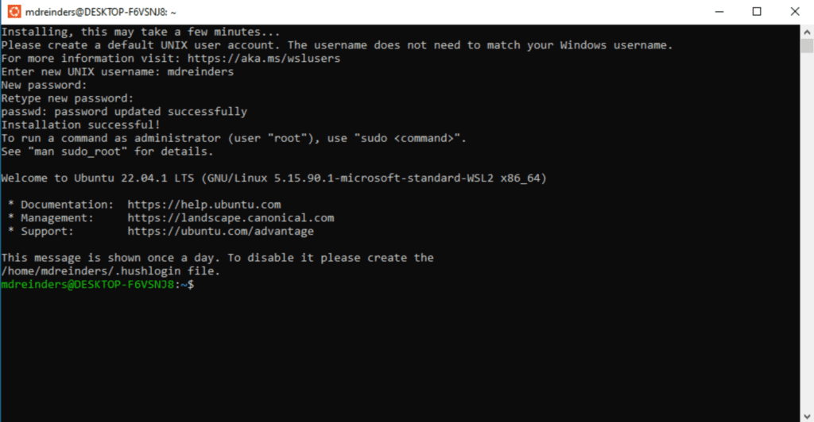
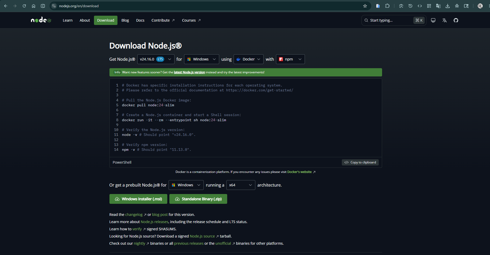

# 1.2 Install everything

This is the big setup lesson. By the end your computer, whether it runs Windows,
macOS, or Linux, will be a real coding machine: a proper terminal, a code editor,
Node.js, Git, and a GitHub account. Take your time and do the steps in order.

!!! tip "This is the longest lesson in the course"
    Plan for about an hour, and do not feel you must finish it in one sitting.
    After each step there is a checkpoint. Stop at any checkpoint, take a break,
    and come back later. The checkpoints tell you exactly where you are.

## What you'll know by the end

- What an operating system is, and which one suits coding
- How to get a proper terminal on your system
- How to install Node.js, VS Code, and Git
- Why we use an IDE, and why VS Code first
- How to create a GitHub account and connect Git to it

---

## A quick word on operating systems

An **operating system** (Roman Urdu: woh bunyadi software jo poora computer
chalata hai), or OS, is the software that runs your whole computer. It sits
between you and the machine. Your apps talk to the OS, and the OS talks to the
hardware. Every program you open, from Chrome to a game, runs on top of it.

<figure markdown>
<svg viewBox="0 0 760 290" xmlns="http://www.w3.org/2000/svg" role="img" aria-labelledby="svg-os-layers" style="max-width:100%;height:auto">
  <title id="svg-os-layers">Three stacked layers: at the top are you and your apps, in the middle is the operating system that manages everything, and at the bottom is the hardware.</title>
  <g stroke="#1f1f1c" stroke-width="1.5">
    <rect x="110" y="20" width="540" height="70" rx="10" fill="#ffffff"/>
    <rect x="110" y="110" width="540" height="70" rx="10" fill="#ffffff"/>
    <rect x="110" y="200" width="540" height="70" rx="10" fill="#ffffff"/>
  </g>
  <g font-family="Inter, sans-serif" text-anchor="middle">
    <text x="380" y="50" font-size="16" font-weight="600" fill="#1f1f1c">You and your apps</text>
    <text x="380" y="72" font-size="12" fill="#6b6b65">Chrome, VS Code, WhatsApp, games</text>
    <text x="380" y="140" font-size="16" font-weight="600" fill="#1f1f1c">Operating system</text>
    <text x="380" y="162" font-size="12" fill="#6b6b65">Windows, macOS, or Linux: the manager in the middle</text>
    <text x="380" y="230" font-size="16" font-weight="600" fill="#1f1f1c">Hardware</text>
    <text x="380" y="252" font-size="12" fill="#6b6b65">the chip, memory, screen, and storage</text>
  </g>
  <defs>
    <marker id="bq-arrow-os" viewBox="0 0 10 10" refX="9" refY="5" markerWidth="7" markerHeight="7" orient="auto-start-reverse">
      <path d="M0 0 L10 5 L0 10 z" fill="currentColor"/>
    </marker>
  </defs>
  <g stroke="currentColor" stroke-width="1.5" fill="none" marker-end="url(#bq-arrow-os)" marker-start="url(#bq-arrow-os)">
    <line x1="78" y1="55" x2="78" y2="235"/>
  </g>
  <g font-family="Inter, sans-serif" font-size="11" fill="currentColor" text-anchor="middle">
    <text x="36" y="145" transform="rotate(-90 36 145)">via the OS</text>
  </g>
</svg>
<figcaption>The operating system is the manager in the middle. Your apps never touch the hardware directly; they ask the OS, and the OS handles it.</figcaption>
</figure>

### The big three

Almost every computer runs one of three operating systems. Each has a logo you
already know.

- :material-microsoft-windows: **Windows**, by Microsoft. The most common OS on laptops and in homes, schools, and offices.
- :material-apple: **macOS**, by Apple. Runs only on Apple computers (MacBook, iMac).
- :material-linux: **Linux**, free and open. It powers most servers on the internet, and many developers use it on their own machines too.

### What changes when you switch OS

Moving to a different OS is like moving to a city with different rules. The big
differences you feel are:

- **The apps.** Some programs are made for one OS only. A `.exe` installer is for Windows; a `.dmg` is for macOS.
- **The file paths.** Windows writes `C:\Users\Ali`, while macOS and Linux write `/home/ali`.
- **The terminal.** Windows uses PowerShell; macOS and Linux use a Unix shell. Most coding tutorials online assume the Unix shell.
- **Installing software.** Linux and macOS install most tools with one command in the terminal. Windows usually uses installers you download and click.

### Which OS is best for coding?

The honest answer: all three work. But they are not equal for a beginner who
wants to code. Here is how they compare.

| | :material-microsoft-windows: Windows | :material-apple: macOS | :material-linux: Linux |
| --- | --- | --- | --- |
| Easy for a beginner | Very easy | Easy | Takes some learning |
| Ready for coding tools | Good, great with WSL2 | Very good | Excellent |
| Comes with the machine | Most laptops | Apple devices only | You install it free |
| Cost | Included with most laptops | Apple hardware, costly | Free for any computer |
| Security | Good, but a big target, so keep it updated | Very good | Very good |
| Who uses it | Most people and students | Many developers and designers | Servers and many developers |

<figure markdown>
<svg viewBox="0 0 760 210" xmlns="http://www.w3.org/2000/svg" role="img" aria-labelledby="svg-os-share" style="max-width:100%;height:auto">
  <title id="svg-os-share">A rough bar chart of the main operating system on professional developers' computers: Windows around 47 percent, macOS around 33 percent, Linux around 20 percent.</title>
  <g fill="#1f1f1c">
    <rect x="150" y="34" width="226" height="26" rx="4"/>
    <rect x="150" y="92" width="158" height="26" rx="4"/>
    <rect x="150" y="150" width="96" height="26" rx="4"/>
  </g>
  <g font-family="Inter, sans-serif" font-size="13" fill="#1f1f1c">
    <text x="20" y="52">Windows</text>
    <text x="20" y="110">macOS</text>
    <text x="20" y="168">Linux</text>
  </g>
  <g font-family="Inter, sans-serif" font-size="13" fill="#6b6b65">
    <text x="386" y="52">about 47%</text>
    <text x="318" y="110">about 33%</text>
    <text x="256" y="168">about 20%</text>
  </g>
</svg>
<figcaption>Roughly how professional developers' main computers split. It is approximate and shifts every year, but it shows that all three are common.</figcaption>
</figure>

!!! note "What we do in this course"
    If you use Windows, you do not have to choose between Windows and Linux. You
    will run Linux **inside** Windows with a tool called WSL2. You keep all your
    normal Windows apps, and you also get the Linux terminal that coding tools
    love.

<figure markdown>
<svg viewBox="0 0 760 230" xmlns="http://www.w3.org/2000/svg" role="img" aria-labelledby="svg-wsl" style="max-width:100%;height:auto">
  <title id="svg-wsl">A big Windows box containing your normal apps on the left, and a smaller Ubuntu Linux box on the right that holds your coding tools. WSL2 runs the Linux box inside Windows.</title>
  <g stroke="#1f1f1c" stroke-width="1.5" fill="#ffffff">
    <rect x="30" y="30" width="700" height="170" rx="12"/>
    <rect x="400" y="70" width="305" height="110" rx="10"/>
  </g>
  <g font-family="Inter, sans-serif">
    <text x="50" y="55" font-size="15" font-weight="700" fill="#1f1f1c">Windows</text>
    <text x="60" y="120" font-size="13" fill="#6b6b65">Your normal apps:</text>
    <text x="60" y="142" font-size="13" fill="#6b6b65">Chrome, Word, games</text>
    <text x="416" y="95" font-size="14" font-weight="700" fill="#1f1f1c">Ubuntu (Linux) via WSL2</text>
    <text x="416" y="124" font-size="12" fill="#6b6b65">your terminal, Node.js, Git,</text>
    <text x="416" y="142" font-size="12" fill="#6b6b65">the coding tools</text>
  </g>
</svg>
<figcaption>WSL2 puts a real Linux inside Windows. You get Windows apps and Linux coding tools on one machine.</figcaption>
</figure>

!!! warning "These are big downloads"
    The tools below are large, and on Windows WSL2 also downloads Ubuntu. Use good
    internet if you can, and plug in your charger, since some steps restart the
    computer.

---

## Step 1: Get a working terminal

This first part is the one that differs by operating system, so pick your tab.

=== "Windows 11"

    Windows 11 can run Linux inside it with WSL2, giving you the tools developers expect without leaving Windows.

    1. Click :material-microsoft-windows: **Start** and type `PowerShell`.
    2. Right click **Windows PowerShell**, choose **Run as administrator**, and click **Yes**.
    3. Type this command and press Enter:

        ```powershell
        wsl --install
        ```

    4. Wait for it to finish. It downloads Ubuntu Linux, so this takes a few minutes.
    5. When it asks you to reboot, save your work and restart.

=== "Windows 10"

    Windows 10 works the same way, with one extra step on older builds.

    1. Click :material-microsoft-windows: **Start**, type `PowerShell`, right click it and choose **Run as administrator**.
    2. Run `wsl --install`. On recent Windows 10 this is all you need.
    3. If that command fails, turn on two features first: click :material-microsoft-windows: **Start**, type `Windows Features`, open **Turn Windows features on or off**, tick **Virtual Machine Platform** and **Windows Subsystem for Linux**, click **OK**, and reboot. Then run `wsl --install` again.

=== ":material-apple: macOS"

    macOS already ships with a Unix terminal, so there is no WSL to install.

    1. Press `Cmd + Space`, type `Terminal`, and press Enter to open it.
    2. Install Homebrew, the macOS package manager, by following the one command on [brew.sh](https://brew.sh). You will use it to install the other tools.

=== ":material-linux: Linux"

    You are already on Linux, so you have a terminal and a package manager.

    1. Open your terminal, often with `Ctrl + Alt + T`.
    2. That is it. Where Windows users run Ubuntu inside WSL, you use your system directly.

!!! warning "Windows: if your laptop can't run WSL2"
    Some older laptops cannot run WSL2, and that is fine. You can do the whole
    course the Windows native way instead. Skip the Ubuntu step below, and install
    the normal Windows versions of Node.js, VS Code, and Git from the download
    links in each step. When a lesson shows a `bash` command, run it in the **Git
    Bash** terminal that comes with Git for Windows.

---

## Step 2: Finish your Linux setup (Windows users)

!!! note "macOS and Linux users"
    You already have your terminal, so you can skip this step and go to Step 3.

After the restart, Ubuntu opens on its own to finish setup. If it does not, click
:material-microsoft-windows: **Start** and click **Ubuntu**.

1. Wait while Ubuntu installs. The first run takes a minute.
2. When asked, type a new UNIX username. Use lowercase letters, like `ali`.
3. When asked, type a password and press Enter, then type it again to confirm.

The password does not show on screen as you type. You will see nothing move, no
dots, no stars. That is normal, and is how Linux hides it. Type carefully and
press Enter.



??? note urdu "اردو میں مزید وضاحت"
    جب آپ Ubuntu میں پاس ورڈ ٹائپ کرتے ہیں تو اسکرین پر کچھ نظر نہیں آتا، نہ
    حروف نہ نقطے۔ یہ خرابی نہیں ہے۔ لینکس میں پاس ورڈ اسی طرح چھپا رہتا ہے تاکہ
    کوئی دیکھ نہ سکے۔ آرام سے ٹائپ کریں اور Enter دبائیں۔

Remember this password. You will need it when you install things later.

!!! tip "How to close Ubuntu and open it again"
    You can close the Ubuntu window any time to exit. To start it again later, you
    have two easy ways: click :material-microsoft-windows: **Start** and type
    `Ubuntu`, or open any terminal and type `wsl`. Both drop you straight back into
    your Linux machine.

!!! success "Checkpoint 1: your terminal is ready"
    Windows users have Ubuntu set up; macOS and Linux users have their terminal. A
    safe place to stop. Next you install your code editor.

---

## Step 3: Install VS Code (your code editor)

### What is an IDE, and why VS Code?

An **IDE** (Roman Urdu: aik hi app jisme code likhne ke saare auzaar hote hain),
short for integrated development environment, is one app that brings together
everything you need to write code: a text editor, a file explorer, a built-in
terminal, search, and add-ons. A plain text editor only edits text. An IDE helps
you write, run, and fix code all in one place.

Why VS Code? It is free, fast, runs on every OS, and is by far the most popular
editor among developers, so help and add-ons are everywhere. There are others:
WebStorm is powerful but paid, Sublime Text and Zed are very fast and light, and
Cursor is VS Code with AI built in. You can try them later. We all use VS Code
here so we are looking at the same screen.

!!! tip "A few VS Code shortcuts worth learning now"
    Learn them one at a time. They save you hours.

    - `Ctrl + S` save the file
    - `Ctrl + /` comment or uncomment the current line
    - `` Ctrl + ` `` open or close the built-in terminal
    - `Alt + Up` and `Alt + Down` move the current line up or down
    - `Ctrl + P` jump to any file by typing its name
    - `Ctrl + Shift + P` open the command palette, which runs any VS Code command

    VS Code also has a time-saver called **Emmet** that turns short abbreviations
    into full HTML. You will meet it in the HTML chapter.

### Install it

Download VS Code from [code.visualstudio.com/download](https://code.visualstudio.com/download)
and pick your system, then follow your tab.

=== "Windows"

    1. Run the installer you downloaded and accept the defaults.
    2. Open VS Code, click the :material-puzzle: **Extensions** icon on the left bar (it looks like four small squares).
    3. Search for `WSL` and install the **WSL** extension by Microsoft.
    4. Open your Ubuntu terminal and type `code .` to open VS Code connected to Linux.
    5. Look at the bottom-left corner for a small green box. That green box means VS Code is running inside Ubuntu, which is what you want.

=== ":material-apple: macOS"

    1. Open the downloaded file and drag **Visual Studio Code** into your **Applications** folder.
    2. Open it from Applications, or with `Cmd + Space` then type `Code`.

=== ":material-linux: Linux"

    1. Install the `.deb` or `.rpm` you downloaded, or run `sudo snap install code --classic`.
    2. Open it from your apps menu, or type `code .` in a terminal.

!!! success "Checkpoint 2: your editor is ready"
    VS Code is installed (and on Windows it connects to Ubuntu with the green box).
    Next you install Node.js.

---

## Step 4: Install Node.js

**Node.js** lets you run JavaScript outside the browser, and it comes with
**npm**, the tool that installs code packages. You will use both constantly.

Open [nodejs.org/en/download](https://nodejs.org/en/download). This page builds
the exact install commands for your system. Make sure **npm** is selected, it
almost always is. If you see a **Docker** option and plan to use it, pick that
too. The site is smart and usually detects the right choices for you. This is
just in case.



=== "Windows (in Ubuntu), Linux, macOS"

    Use **nvm**, which installs Node.js and lets you switch versions later without breaking anything. In your terminal:

    1. Install nvm:

        ```bash
        curl -o- https://raw.githubusercontent.com/nvm-sh/nvm/v0.40.1/install.sh | bash
        ```

    2. Close the terminal and open it again, so nvm loads.
    3. Install the latest long-term-support version of Node:

        ```bash
        nvm install --lts
        ```

    4. Check that both work. You should see two version numbers:

        ```bash
        node -v
        npm -v
        ```

=== "Windows without WSL"

    1. On the download page, choose the **Windows Installer (.msi)** for the LTS version.
    2. Run it and accept the defaults.
    3. Open a new terminal and check it worked: `node -v` and `npm -v` should each print a version number.

!!! success "Checkpoint 3: Node.js works"
    `node -v` and `npm -v` both print version numbers. npm comes with Node, so you
    do not install it separately.

---

## Step 5: Create your GitHub account first

**GitHub** is a website where you store your code online and share it. We make
the account now, before Git, because Git needs to match it.

1. Open [github.com](https://github.com) and click **Sign up**.
2. Use an email you check often, for example your Gmail.
3. Pick a username you are happy to show people. It becomes part of your web address.
4. Confirm your email when GitHub sends you a message.

!!! warning "Remember these two things"
    Write down the **email** and the **username** you chose. In the next step you
    will give Git the exact same email and username, so your commits link to this
    GitHub account.

---

## Step 6: Install and set up Git

**Git** tracks the history of your code. Install it, then connect it to the
GitHub account you just made.

=== "Windows (in Ubuntu), Linux"

    Install Git from your terminal:

    ```bash
    sudo apt update && sudo apt install git
    ```

    Type your Ubuntu password if it asks, then press `y` to confirm.

=== "Windows without WSL"

    Download **Git for Windows** from [git-scm.com/install/windows](https://git-scm.com/install/windows) and run the installer. It also gives you the Git Bash terminal.

=== ":material-apple: macOS"

    Run `brew install git`, or just type `git --version` and macOS will offer to install the developer tools that include Git.

Now tell Git who you are. Use the **same username and email** as your GitHub
account:

```bash
# use the same username you chose on GitHub
git config --global user.name "your-github-username"
# use the same email you signed up to GitHub with
git config --global user.email "you@example.com"
```

!!! success "Checkpoint 4: you are fully set up"
    Git is installed and linked to your GitHub account, with the matching username
    and email. Your computer is now a real coding machine.

---

## Knowledge check

Don't write anything down. Just see if you can answer these in your head. If you
can't, scroll back up. That's exactly what this section is for.

1. In one sentence, what does an operating system do?
2. On Windows, what does WSL2 give you that plain Windows does not?
3. Why does the password show nothing while you type it in Ubuntu?
4. Why do we create the GitHub account before setting up Git?
5. Which two commands check that Node.js and npm work?

---

## What's next

Your computer is now a real coding machine. You have a terminal, VS Code,
Node.js, Git, and a GitHub account. Next you will learn the terminal properly,
the text window where you typed those commands. It is faster than the mouse once
you know it.

[Next lesson: 1.3 The terminal &rarr;](1-3-the-terminal.md){ .next-lesson }

---

## Going deeper (optional)

These are for the curious. You don't need them to continue.

- Microsoft: [Install WSL](https://learn.microsoft.com/windows/wsl/install) the full official guide.
- VS Code: [Developing in WSL](https://code.visualstudio.com/docs/remote/wsl) how the WSL extension works.
- nvm: [nvm on GitHub](https://github.com/nvm-sh/nvm) the official project page.

---

<!-- The Mark Complete button is injected here automatically by the site template. -->

<!-- Glossary tooltips used in this lesson. -->
*[operating system]: The software that runs your whole computer and sits between your apps and the hardware. Windows, macOS, and Linux are operating systems. (Roman Urdu: woh bunyadi software jo poora computer chalata hai)
*[OS]: Short for operating system. (Roman Urdu: operating system ka chhota naam)
*[IDE]: An app that bundles everything for writing code: editor, file explorer, terminal, and add-ons. VS Code is one. (Roman Urdu: aik hi app jisme code likhne ke saare auzaar hote hain)
*[WSL2]: Windows Subsystem for Linux, version 2. It runs a real Linux system inside Windows. (Roman Urdu: Windows ke andar Linux chalane ka tareeqa)
*[Ubuntu]: A popular kind of Linux. It is what WSL2 installs by default. (Roman Urdu: Linux ki ek mashhoor qism)
*[Node.js]: A program that runs JavaScript outside the browser. (Roman Urdu: aisa program jo JavaScript ko browser ke baghair chalata hai)
*[npm]: The tool that installs code packages for Node.js. It comes with Node.js. (Roman Urdu: Node.js ke packages install karne ka tool)
*[nvm]: Node Version Manager. It installs Node.js and lets you switch versions easily. (Roman Urdu: Node ke alag alag versions sambhaalne wala tool)
*[Git]: A tool that tracks the history of your code. (Roman Urdu: code ki history sambhaalne wala tool)
*[GitHub]: A website where you store your code online and share it. (Roman Urdu: code online rakhne aur share karne ki website)
*[terminal]: A text window where you type commands for the computer. (Roman Urdu: woh window jahan tum computer ko command likhte ho)
