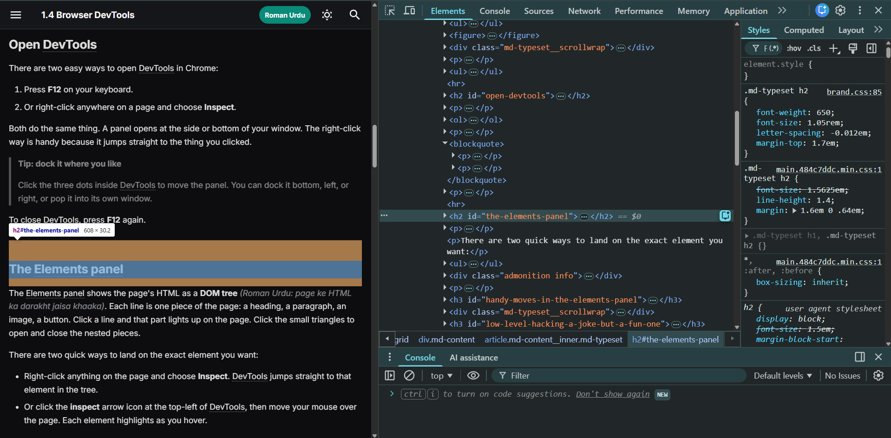
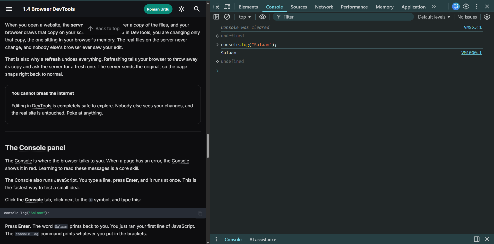
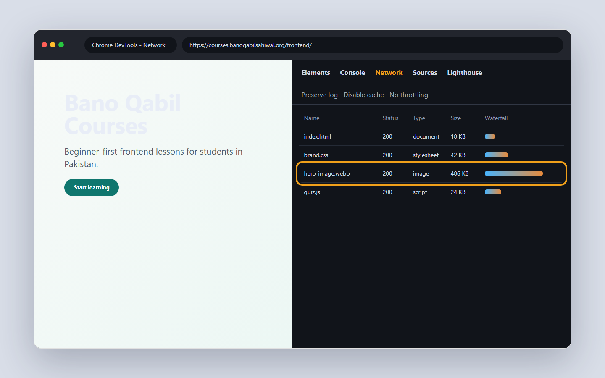
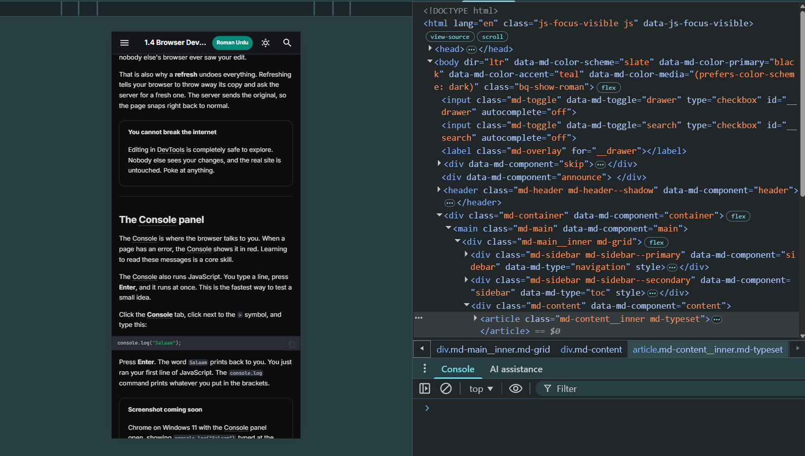

# 1.4 Browser DevTools

Every website you visit is just code your browser drew on the screen. Hidden
inside your browser is a set of tools that lets you open that code and look
inside. These are the developer tools, or DevTools. Every frontend developer
lives in them, all day, every day.

## What you'll know by the end

- What DevTools are and why you will use them constantly
- How to open DevTools in Chrome on Windows
- How to read and edit a page's HTML and CSS in the Elements panel
- How to see errors and run JavaScript in the Console
- How to watch files load in the Network panel
- How to preview a page as a phone
- Why your DevTools edits are only visible to you

---

## What DevTools are

DevTools is a panel built into your browser. It shows you the code behind any
page. You can read it, change it, and test things, all in real time.

You did not install anything for this. Chrome, Edge, and Firefox all ship with
DevTools already inside. We use Chrome on Windows here, since that is what most
of you have.

Why does this matter so much? When your page looks wrong, DevTools shows you
why. When something breaks, the Console tells you what broke. You stop guessing.
You start seeing.

??? note urdu "اردو میں مزید وضاحت"
    ڈیو ٹولز آپ کے براؤزر کے اندر چھپا ہوا ایک پینل ہے۔ یہ کسی بھی صفحے کا کوڈ
    آپ کو دکھاتا ہے۔ آپ اسے پڑھ سکتے ہیں، بدل سکتے ہیں، اور آزما سکتے ہیں۔ جب
    صفحہ ٹھیک نہ دکھے، تو ڈیو ٹولز بتاتا ہے کہ مسئلہ کہاں ہے۔

---

## Which browser should you use?

You can open a website in many browsers, and most of them are built on the same
engine under the hood.

- **Chromium-based**: Chrome, Edge, Brave, and Opera all share Google's Chromium engine, so they look and inspect almost the same.
- **Firefox** uses its own engine, Gecko, and its own DevTools.
- **Safari** uses Apple's engine, WebKit, and runs only on Apple devices.

<figure markdown>
<svg viewBox="0 0 760 210" xmlns="http://www.w3.org/2000/svg" role="img" aria-labelledby="svg-browser-share" style="max-width:100%;height:auto">
  <title id="svg-browser-share">Approximate global browser share: Chrome about 65 percent, Safari about 18 percent, Edge about 5 percent, Firefox about 3 percent, and others about 9 percent.</title>
  <g fill="#1f1f1c">
    <rect x="150" y="24" width="364" height="22" rx="4"/>
    <rect x="150" y="62" width="101" height="22" rx="4"/>
    <rect x="150" y="100" width="28" height="22" rx="4"/>
    <rect x="150" y="138" width="17" height="22" rx="4"/>
    <rect x="150" y="176" width="50" height="22" rx="4"/>
  </g>
  <g font-family="Inter, sans-serif" font-size="13" fill="#1f1f1c">
    <text x="20" y="40">Chrome</text>
    <text x="20" y="78">Safari</text>
    <text x="20" y="116">Edge</text>
    <text x="20" y="154">Firefox</text>
    <text x="20" y="192">Others</text>
  </g>
  <g font-family="Inter, sans-serif" font-size="13" fill="#6b6b65">
    <text x="524" y="40">about 65%</text>
    <text x="261" y="78">about 18%</text>
    <text x="188" y="116">about 5%</text>
    <text x="177" y="154">about 3%</text>
    <text x="210" y="192">about 9%</text>
  </g>
</svg>
<figcaption>Roughly how the world's browsers split today. It is approximate and changes over time, but Chrome's lead is a big reason most tutorials use it.</figcaption>
</figure>

| Browser | Built on | DevTools | Good to know |
| --- | --- | --- | --- |
| :material-google-chrome: Chrome | Chromium | Excellent | What we use. Most tutorials and extensions. |
| :material-microsoft-edge: Edge | Chromium | Excellent | Almost identical to Chrome. |
| Brave | Chromium | Excellent | Chrome-like, privacy focused. |
| :material-firefox: Firefox | Gecko | Very good | Great, but its DevTools sit in different places. |
| :material-apple-safari: Safari | WebKit | Good | Apple devices only. Test it if your users are on iPhone. |

We use **Chrome** in this course because it is the most popular, its DevTools are
the most complete, and almost every tutorial you find online shows Chrome. If you
prefer a different browser, here is what to expect:

- **Edge or Brave**: you are basically using Chrome under the hood, so every step in this course works the same.
- **Firefox**: everything works, but the menus and DevTools panels sit in different places, so our screenshots will not match exactly.
- **Safari**: it runs only on Mac and iPhone, its DevTools look quite different and must be turned on first in Settings. Fine as a second browser, not the easiest to follow this course with.

---

## Open DevTools

There are two easy ways to open DevTools in Chrome:

1. Press **F12** on your keyboard.
2. Or right-click anywhere on a page and choose **Inspect**.

Both do the same thing. A panel opens at the side or bottom of your window. The
right-click way is handy because it jumps straight to the thing you clicked.

> **Tip: dock it where you like**
>
> Click the three dots inside DevTools to move the panel. You can dock it
> bottom, left, or right, or pop it into its own window.

To close DevTools, press **F12** again.

---

## The Elements panel

The Elements panel shows the page's HTML as a **DOM tree** (Roman Urdu: page ke
HTML ka darakht jaisa khaaka). Each line is one piece of the page: a heading, a
paragraph, an image, a button. Click a line and that part lights up on the page.
Click the small triangles to open and close the nested pieces.

There are two quick ways to land on the exact element you want:

- Right-click anything on the page and choose **Inspect**. DevTools jumps straight to that element in the tree.
- Or click the **inspect** arrow icon at the top-left of DevTools, then move your mouse over the page. Each element highlights as you hover.



On the side you see the **Styles** pane: the CSS for the selected element. CSS is
the code that sets colours, sizes, and spacing. Change a value there and the page
updates instantly.

### Handy moves in the Elements panel

| To do this | Do this |
| --- | --- |
| Edit the text of an element | double-click the text and type |
| Edit the raw HTML of an element | right-click the line and choose **Edit as HTML**, or press `F2` |
| Change a colour or size | edit a value in the **Styles** pane |
| Hide an element | click it and press `H` |
| Delete an element | click it and press `Delete` |

### Low level hacking (a joke, but a fun one)

Let us "hack" a famous website. We are not really hacking anything, but it does
feel like it.

1. Open [google.com](https://google.com) in Chrome.
2. Right-click the **Google Search** button and choose **Inspect**.
3. The button's line lights up in the Elements panel. Press `F2`, or right-click the line and choose **Edit as HTML**.
4. Change the button's text to your name, like `Ali Search`, and press Enter.
5. Look at the page. The button now reads `Ali Search`. You just "edited" Google.

Show a friend and watch their face. Then read the next part, because there is an
honest catch.

### Why only you can see it

You did not change Google for the world. You changed it only on your own screen,
for this one moment. Here is why.

<figure markdown>
<svg viewBox="0 0 760 210" xmlns="http://www.w3.org/2000/svg" role="img" aria-labelledby="svg-localedit" style="max-width:100%;height:auto">
  <title id="svg-localedit">The server holds the real website files and sends your browser a copy. Your edits in DevTools change only that copy. A refresh asks the server again and gets the original back.</title>
  <g stroke="#1f1f1c" stroke-width="1.5" fill="#ffffff">
    <rect x="40" y="55" width="270" height="90" rx="10"/>
    <rect x="450" y="55" width="270" height="90" rx="10"/>
  </g>
  <g font-family="Inter, sans-serif" text-anchor="middle">
    <text x="175" y="92" font-size="15" font-weight="600" fill="#1f1f1c">The server</text>
    <text x="175" y="115" font-size="12" fill="#6b6b65">holds the real website files</text>
    <text x="585" y="92" font-size="15" font-weight="600" fill="#1f1f1c">Your browser</text>
    <text x="585" y="115" font-size="12" fill="#6b6b65">a copy drawn on your screen</text>
  </g>
  <defs>
    <marker id="bq-arrow-le" viewBox="0 0 10 10" refX="9" refY="5" markerWidth="7" markerHeight="7" orient="auto-start-reverse">
      <path d="M0 0 L10 5 L0 10 z" fill="currentColor"/>
    </marker>
  </defs>
  <g stroke="currentColor" stroke-width="1.5" fill="none" marker-end="url(#bq-arrow-le)">
    <line x1="310" y1="85" x2="450" y2="85"/>
    <line x1="450" y1="120" x2="310" y2="120"/>
  </g>
  <g font-family="Inter, sans-serif" font-size="12" fill="currentColor" text-anchor="middle">
    <text x="380" y="75">1. sends a copy</text>
    <text x="380" y="140">3. refresh gets the original</text>
  </g>
  <g font-family="Inter, sans-serif" font-size="12" fill="#6b6b65" text-anchor="middle">
    <text x="585" y="172">2. your edits change only this copy</text>
  </g>
</svg>
<figcaption>The server sends your browser a copy of the page. Your DevTools edits change only that copy. A refresh fetches the original again, so your changes vanish.</figcaption>
</figure>

When you open a website, the **server** sends your browser a *copy* of the files,
and your browser draws that copy on your screen. When you edit in DevTools, you
are changing only that copy, the one sitting in your browser's memory. The real
files on the server never change, and nobody else's browser ever saw your edit.

That is also why a **refresh** undoes everything. Refreshing tells your browser to
throw away its copy and ask the server for a fresh one. The server sends the
original, so the page snaps right back to normal.

!!! tip "You cannot break the internet"
    Editing in DevTools is completely safe to explore. Nobody else sees your
    changes, and the real site is untouched. Poke at anything.

---

## The Console panel

The Console is where the browser talks to you. When a page has an error, the
Console shows it in red. Learning to read these messages is a core skill.

The Console also runs JavaScript. You type a line, press **Enter**, and it runs
at once. This is the fastest way to test a small idea.

Click the **Console** tab, click next to the `>` symbol, and type this:

```js
console.log("Salaam");
```

Press **Enter**. The word `Salaam` prints back to you. You just ran your first
line of JavaScript. The `console.log` command prints whatever you put in the
brackets.



> **Did you know**
>
> `console.log` is the most used line in all of JavaScript. Even developers
> with twenty years of work still drop it in to check what a value is.

---

## The Network panel

When a page opens, it pulls in many files: the HTML, the CSS, images, fonts,
and more. The Network panel shows each one loading, in order, with its size and
its time.

Open the **Network** tab, then refresh the page. A list fills up as files
arrive. A slow or heavy file sticks out, since its bar is long.



The highlighted row is the kind of file you inspect first: it is large, and its waterfall bar is longer than the others.

This panel matters a lot in Pakistan. Many users wait on slow connections. The
Network panel shows you which file is making them wait, so you can fix it.

---

## The Device toolbar

Most people in Pakistan browse on phones, not laptops. So your page must look
good on a small screen first. The Device toolbar lets you preview that without
owning ten phones.

Inside DevTools, click the small phone-and-tablet icon near the top left. The
page shrinks to a phone-sized view. A menu at the top lets you pick a model,
like an iPhone or a common Android size.



The Device toolbar previews a phone shape right inside your laptop, which is
enough for most checks. When you want to see your site inside many different
phone and tablet frames quickly, you can also install a Chrome extension like
[Mobile Simulator](https://chromewebstore.google.com/detail/mobile-simulator-responsi/ckejmhbmlajgoklhgbapkiccekfoccmk?hl=en).
It opens your page in a range of real device sizes side by side, which is handy
before you hand a site to a client.

> **Tip: design for the phone first**
>
> Check your phone view often as you build. It is much easier than fixing a
> broken mobile layout at the end.

---

### Try this (5 minutes)

1. Open Chrome and go to [developer.mozilla.org](https://developer.mozilla.org).
2. Press **F12** to open DevTools.
3. Click the **Elements** tab. Find the main heading in the tree.
4. Double-click its text and type your own name. Watch the page change.
5. Click the **Console** tab. Type `console.log("Salaam")` and press **Enter**.
6. Now refresh the page with **F5**. Your name is gone, since edits are local.

You just inspected a live website, edited it, and ran code. This is the daily
work of a frontend developer.

---

## Knowledge check

Don't write anything down. Just see if you can answer these in your head. If you
can't, scroll back up. That's exactly what this section is for.

1. What are two ways to open DevTools in Chrome?
2. What does the Elements panel let you see and change?
3. What happens to your DevTools edits when you refresh the page?
4. What does `console.log("Salaam")` do?
5. Why does the Device toolbar matter for a Pakistani audience?

---

!!! success "You finished Chapter 1"
    You set up your tools and learned to look inside any web page. That is a
    real start, and the hard part of getting ready is now behind you.

---

## Assignment

!!! bq-assignment "Build your toolkit, and the habit of finding tools yourself"
    A developer's real skill is not memorising tools, it is knowing how to search for the right one and figure it out. Practise that habit now, because you will use it every day for the rest of your career.

    **What you build**

    - A short "my toolkit" list in your learning journal: each tool you tried, what it does, and whether you will keep it.
    - **VS Code extensions:** open the Extensions panel and also search the web for what beginners use. Try a few (for example a live preview, a code formatter, a bracket or icon helper) and note which ones actually help you.
    - **Chrome extensions:** find one or two that help front-end work, like the [Mobile Simulator](https://chromewebstore.google.com/detail/mobile-simulator-responsi/ckejmhbmlajgoklhgbapkiccekfoccmk?hl=en) from this lesson, a colour picker, or a font identifier.
    - **Other tools:** search something like "best free tools for web developers", skim a few lists, and pick two that look useful. Write down why.

    **Done when**

    - [ ] You installed and tried at least three VS Code extensions and noted what each does.
    - [ ] You found at least one Chrome extension that helps your work.
    - [ ] Your journal has a short toolkit list written in your own words.

    **Stretch goal:** For one tool you liked, open its documentation page and write down one thing you learned that the install page did not tell you.

---

## What's next

Chapter 2 begins the real building. You will write your first HTML, the code
that gives every web page its structure and content. Everything you inspected
today, you will now create yourself.

[Start Chapter 2: HTML &rarr;](../chapter-02-html/index.md){ .next-lesson }

---

## Going deeper (optional)

These are for the curious. You don't need them to continue.

- Chrome: [DevTools Elements panel docs](https://developer.chrome.com/docs/devtools/elements) the official guide this lesson's Elements section draws on.
- Chrome: [Chrome DevTools docs](https://developer.chrome.com/docs/devtools) the full official guide to every panel.
- MDN: [What are browser developer tools?](https://developer.mozilla.org/en-US/docs/Learn_web_development/Howto/Tools_and_setup/What_are_browser_developer_tools) a friendly tour of the basics.

*The Elements panel section above is based on Google's official [Chrome DevTools documentation](https://developer.chrome.com/docs/devtools/elements). With thanks and credit to the Chrome DevTools team.*

---

<!-- The Mark Complete button is injected here automatically by the site template. -->

<!-- Glossary tooltips used in this lesson. -->
*[DevTools]: A set of tools built into the browser for inspecting and editing web pages. (Roman Urdu: browser ke andar bana tool jo page ka code dikhata aur badalta hai)
*[Elements panel]: The DevTools tab that shows a page's HTML and CSS, where you can live-edit both. (Roman Urdu: woh tab jahan page ka HTML aur CSS dekh kar badal sakte ho)
*[Console]: The DevTools tab that shows errors and runs small bits of JavaScript. (Roman Urdu: woh tab jahan errors dikhte hain aur JavaScript chalti hai)
*[Network panel]: The DevTools tab that shows every file a page loads, with its size and time. (Roman Urdu: woh tab jo har file ka loading, size aur time dikhata hai)
