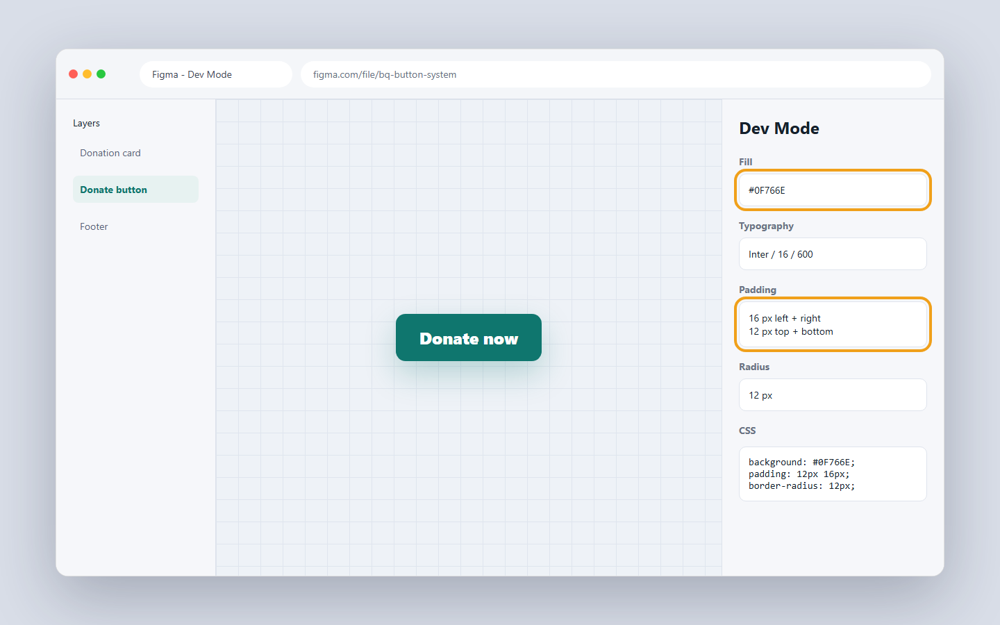
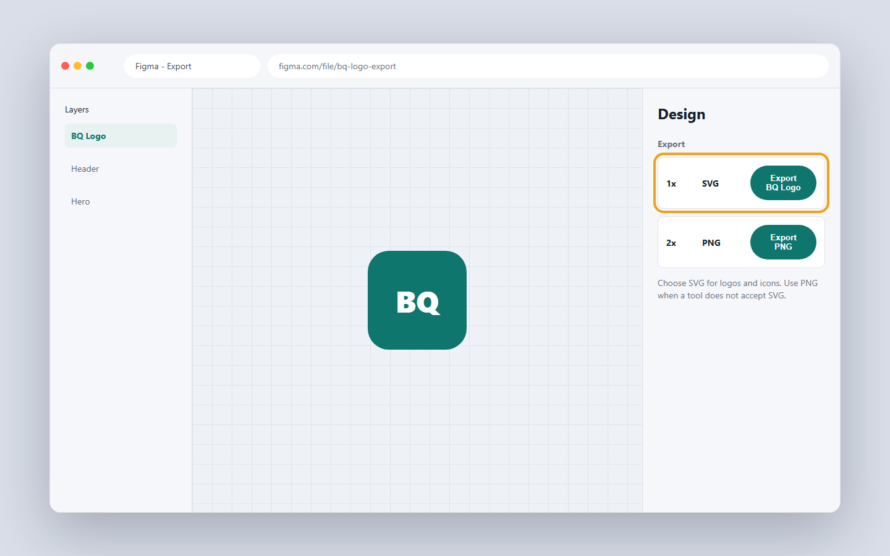

# 5.3 Reading Figma like a developer

A designer hands you a picture of a website. Your job is to turn that picture into real code. The tool that holds this picture is called Figma. In this lesson you learn what Figma is, how to install it, how to navigate it, how to apply the visual-hierarchy ideas from Chapter 4 inside Figma, and how to pull exact values out of a design and map them to Tailwind classes.

## What you'll know by the end

- What Figma is and the difference between the browser version and the desktop app
- Why the desktop app needs a separate font installer, and where to download both
- How to find your way around the full Figma interface: layers panel, canvas, and properties panel
- How the Chapter 4 ideas (visual hierarchy, contrast, spacing, type scale) live inside Figma
- What auto-layout is and why it is the Figma version of CSS flexbox
- How to read colours, fonts, sizes, and spacing in Dev Mode
- How to export an icon or a photo from a design
- How to map Figma CSS values to Tailwind classes

---

## Getting Figma: browser, desktop app, and the font installer

Figma runs inside your web browser at figma.com, so you can open a design file right now without installing anything. The browser version is fine for reading designs and for quick work.

If you will use Figma regularly, the desktop app is better. It stays open as a separate window, loads faster, and does not compete with your browser tabs for memory. There is one important thing to know: the desktop app can use fonts installed on your computer, but only if you also install a small companion called the **Figma Font Helper** (Roman Urdu: ek alag program jo aapke computer ke fonts ko Figma mein use karne deta hai). Without the font helper, the desktop app cannot see fonts you have installed locally, and your designs will show a fallback font instead.

Download both from the official downloads page:

**[https://www.figma.com/downloads/](https://www.figma.com/downloads/)**

That page has three things: the desktop app for Windows or Mac, the font installer for Windows or Mac, and the browser plugin list. Install the desktop app first, then run the font installer. After that, any font you install on your computer will appear in Figma's font picker.

| Version | Pros | Limitation |
| --- | --- | --- |
| Browser (figma.com) | No install needed, works on any computer | Cannot see your local fonts by default |
| Desktop app | Faster, stays in its own window, better for daily use | Needs the separate font installer for local fonts |
| Font Helper (companion) | Bridges local fonts to both browser and desktop | Must be installed and running in the background |

!!! tip "Which to use for this course"
    Start with the browser version to open community files and follow along. When you start building your own designs, install the desktop app and the font helper together.

---

## Signing up for a free account

Open your browser and go to figma.com. Click the sign up button. You can use your email or your Google account. Figma is free for personal use and learning. You do not pay anything to read designs, export assets, or use the community file library.

---

## A full tour of the Figma interface

When you open a Figma file, three panels fill the screen. Learning where each one is and what it does is the whole skill of "reading Figma."

<figure markdown>
<svg viewBox="0 0 800 380" xmlns="http://www.w3.org/2000/svg" role="img" aria-labelledby="svg-figma-full" style="max-width:100%;height:auto">
<title id="svg-figma-full">The Figma interface labelled in detail: a toolbar at the top, layers panel on the left showing a tree of elements, the main canvas in the centre with a frame containing a card design, and the properties panel on the right showing fill colour, font, size, padding, corner radius, and gap values.</title>
<g fill="#1f1f1c" stroke="none">
  <rect x="0" y="0" width="800" height="36" rx="0"/>
</g>
<g fill="#6b6b65" stroke="none">
  <rect x="0" y="36" width="200" height="344" rx="0"/>
  <rect x="600" y="36" width="200" height="344" rx="0"/>
</g>
<g fill="#e8e8e3" stroke="none">
  <rect x="200" y="36" width="400" height="344" rx="0"/>
</g>
<g fill="#ffffff" stroke="#1f1f1c" stroke-width="1.5">
  <rect x="240" y="80" width="320" height="220" rx="10"/>
</g>
<g fill="#f4f4f1" stroke="#1f1f1c" stroke-width="1">
  <rect x="260" y="100" width="280" height="120" rx="6"/>
</g>
<g fill="#0fab95" stroke="none">
  <rect x="280" y="180" width="100" height="28" rx="5"/>
</g>
<g font-family="Inter, sans-serif" font-size="11" fill="#1f1f1c" text-anchor="middle">
  <g><text x="400" y="155">Card heading text</text></g>
  <g><text x="400" y="172">A short description line</text></g>
</g>
<g font-family="Inter, sans-serif" font-size="11" fill="#ffffff" text-anchor="middle">
  <g><text x="330" y="199">Get started</text></g>
</g>
<g font-family="Inter, sans-serif" font-size="11" fill="#1f1f1c" text-anchor="middle">
  <g><text x="400" y="260">Card component</text></g>
</g>
<g font-family="Inter, sans-serif" font-size="10" fill="#6b6b65">
  <g><text x="8" y="62">Frame</text></g>
  <g><text x="14" y="80">Card</text></g>
  <g><text x="20" y="96">Heading</text></g>
  <g><text x="20" y="112">Body</text></g>
  <g><text x="20" y="128">Button</text></g>
  <g><text x="14" y="148">Stats row</text></g>
  <g><text x="14" y="164">Footer</text></g>
</g>
<g font-family="Inter, sans-serif" font-size="9" fill="#f4f4f1">
  <g><text x="608" y="62">Fill</text></g>
  <g><text x="786" y="62" text-anchor="end">#0fab95</text></g>
  <g><text x="608" y="80">Font</text></g>
  <g><text x="786" y="80" text-anchor="end">Inter</text></g>
  <g><text x="608" y="98">Size</text></g>
  <g><text x="786" y="98" text-anchor="end">16 px</text></g>
  <g><text x="608" y="116">Weight</text></g>
  <g><text x="786" y="116" text-anchor="end">600</text></g>
  <g><text x="608" y="134">Padding</text></g>
  <g><text x="786" y="134" text-anchor="end">16 px</text></g>
  <g><text x="608" y="152">Corner R.</text></g>
  <g><text x="786" y="152" text-anchor="end">12 px</text></g>
  <g><text x="608" y="170">Gap</text></g>
  <g><text x="786" y="170" text-anchor="end">8 px</text></g>
  <g><text x="608" y="188">Width</text></g>
  <g><text x="786" y="188" text-anchor="end">320 px</text></g>
</g>
<g font-family="Inter, sans-serif" font-size="12" fill="#ffffff" text-anchor="middle">
  <g><text x="400" y="20">Toolbar: move, frame, shape, text, and component tools</text></g>
</g>
<g font-family="Inter, sans-serif" font-size="11" fill="#f4f4f1" text-anchor="middle">
  <g><text x="100" y="56">Layers panel</text></g>
  <g><text x="400" y="56">Canvas</text></g>
  <g><text x="700" y="56">Properties / Inspect</text></g>
</g>
<g font-family="Inter, sans-serif" font-size="10" fill="#1f1f1c" text-anchor="middle">
  <g><text x="100" y="370">tree of all elements</text></g>
  <g><text x="400" y="370">click to select; scroll and zoom</text></g>
  <g><text x="700" y="370">exact values for selected element</text></g>
</g>
<g stroke="#f4f4f1" stroke-width="0.5" stroke-dasharray="4 3" fill="none">
  <line x1="200" y1="36" x2="200" y2="380"/>
  <line x1="600" y1="36" x2="600" y2="380"/>
</g>
</svg>
<figcaption>The four areas of the Figma screen. Top: the toolbar holds tools for selecting, drawing frames, adding text, and creating components. Left: the layers panel lists every element as a tree. Centre: the canvas is the design space you scroll and zoom. Right: the properties panel shows exact values for whatever you click.</figcaption>
</figure>

### The toolbar

The toolbar runs across the top. It holds the tools you need to work with designs:

- **Move tool** (V): the default. Click to select elements on the canvas.
- **Frame tool** (F): draw a frame, which is Figma's word for a screen or a container.
- **Shape tools**: draw rectangles, ellipses, and lines.
- **Text tool** (T): click anywhere on the canvas and type.
- **Component tool**: create reusable components (explained below).

As a developer reading a design, you mostly stay on the move tool. You click things and read the right panel.

### The layers panel (left)

The layers panel is a tree. Every element in the design has a row here. Groups nest inside groups, just like HTML elements nest inside other HTML elements. You can click a row in the layers panel to select that element on the canvas, or click the element on the canvas to highlight it in the layers panel. Both directions work.

When a design has many overlapping elements, it is sometimes easier to click the layers panel to select the one you want, rather than trying to click the right thing on the canvas.

### The canvas (centre)

The canvas is the large area in the middle. It holds all the frames (screens). You can:

- Scroll with the mouse wheel to move up and down.
- Hold Space and drag to pan in any direction.
- Pinch to zoom (trackpad) or use Ctrl + scroll to zoom in and out.
- Press Shift + 1 to fit the whole file in view, or Shift + 2 to zoom to your selection.

### The properties panel (right)

This is where you do most of your developer work. Click an element and the right panel shows every value: fill colour, font, size, weight, spacing, corner radius, and more. In standard Figma this is the Design panel. When you switch to Dev Mode (explained below), it becomes the Inspect panel and adds CSS code snippets.

### Frames and components

A **frame** (Roman Urdu: Figma mein ek page ya screen, HTML ke section jaisi) is a fixed-size container. Think of it as one phone screen or one desktop screen. Designers put all the elements for one view inside one frame.

A **component** is a reusable building block. The designer makes a button once, turns it into a component, and then places copies of it across many frames. When you see a small four-diamond icon in the layers panel, that is a component. You can click any copy and still read its properties normally.

---

## Chapter 4 ideas inside Figma: designing with hierarchy, contrast, and spacing

You spent Chapter 4 learning why design choices matter for people. Now you see where those choices live in Figma's panels.

### Visual hierarchy in the layers panel

In lesson 4.5 you learned that hierarchy is about guiding the eye from the most important thing to the least important. In a Figma file, hierarchy is visible in the layers panel. The elements at the top of a frame's layer list appear on top visually. Designers name layers clearly (Heading, Body, CTA Button, Trust stats) so the tree reads like an outline of the page. When you open a well-structured design, the layers panel tells you the reading order before you even look at the canvas.

As a developer you can use the layers panel to plan your HTML outline. If the layers say Frame / Header / Hero / Stats / Donate form / Footer, your `<header>`, `<section>`, `<section>`, `<section>` structure writes itself.

### Contrast: reading it from the properties panel

In lesson 4.5 you learned that contrast is the engine of emphasis. In Figma, contrast lives in the Fill and Typography rows of the right panel. When you click the page heading in a design, you might see fill `#111827` (near-black) and font weight 700. When you click the body copy, you might see fill `#6b7280` (medium grey) and weight 400. That drop in fill darkness and weight is the designer expressing contrast. You read it in the panel and copy it faithfully.

### Spacing and a type scale: the layout section

In lesson 4.5 you saw a type scale: five intentional sizes, each with a clear role. In Figma, the typography properties for each text element show you the type scale the designer chose. Click every text element once and note the font sizes. You will usually see three to five distinct values. Those become your Tailwind text size classes.

Spacing appears in the Layout panel on the right. Every auto-layout frame shows its padding and gap values. These map directly to Tailwind spacing classes.

<figure markdown>
<svg viewBox="0 0 700 280" xmlns="http://www.w3.org/2000/svg" role="img" aria-labelledby="svg-ch4-figma" style="max-width:100%;height:auto">
<title id="svg-ch4-figma">A diagram connecting Chapter 4 design concepts to their location in the Figma interface. Visual hierarchy maps to the layers panel order. Contrast maps to fill colour and font weight in the properties panel. Type scale maps to font size values across text layers. Spacing maps to padding and gap in the auto-layout section.</title>
<g fill="#ffffff" stroke="#1f1f1c" stroke-width="1.5">
  <rect x="20" y="30" width="160" height="220" rx="8"/>
  <rect x="260" y="30" width="200" height="220" rx="8"/>
  <rect x="540" y="30" width="140" height="220" rx="8"/>
</g>
<g font-family="Inter, sans-serif" font-size="12" font-weight="600" fill="#1f1f1c" text-anchor="middle">
  <g><text x="100" y="22">Chapter 4 concept</text></g>
  <g><text x="360" y="22">Where it lives in Figma</text></g>
  <g><text x="610" y="22">What you read as a dev</text></g>
</g>
<g font-family="Inter, sans-serif" font-size="11" fill="#1f1f1c">
  <g><text x="30" y="65">Visual hierarchy</text></g>
  <g><text x="30" y="115">Contrast</text></g>
  <g><text x="30" y="165">Type scale</text></g>
  <g><text x="30" y="215">Spacing / rhythm</text></g>
</g>
<g font-family="Inter, sans-serif" font-size="10" fill="#6b6b65">
  <g><text x="270" y="60">Layers panel: top items</text></g>
  <g><text x="270" y="74">appear first / most prominent</text></g>
  <g><text x="270" y="110">Fill colour + font weight</text></g>
  <g><text x="270" y="124">in the properties panel</text></g>
  <g><text x="270" y="160">Font size across text layers;</text></g>
  <g><text x="270" y="174">usually 3 to 5 distinct sizes</text></g>
  <g><text x="270" y="210">Auto-layout: padding and gap</text></g>
  <g><text x="270" y="224">values in the Layout section</text></g>
</g>
<g font-family="Inter, sans-serif" font-size="10" fill="#0fab95">
  <g><text x="550" y="60">Layer order</text></g>
  <g><text x="550" y="74">and nesting</text></g>
  <g><text x="550" y="110">Hex codes,</text></g>
  <g><text x="550" y="124">weight numbers</text></g>
  <g><text x="550" y="160">px sizes that</text></g>
  <g><text x="550" y="174">become text-* classes</text></g>
  <g><text x="550" y="210">px gaps that</text></g>
  <g><text x="550" y="224">become gap-* classes</text></g>
</g>
<g stroke="#6b6b65" stroke-width="0.5" stroke-dasharray="3 3" fill="none">
  <line x1="20" y1="86" x2="700" y2="86"/>
  <line x1="20" y1="136" x2="700" y2="136"/>
  <line x1="20" y1="186" x2="700" y2="186"/>
</g>
<defs>
  <marker id="bq-arr-ch4" viewBox="0 0 10 10" refX="9" refY="5" markerWidth="6" markerHeight="6" orient="auto-start-reverse">
    <path d="M0 0 L10 5 L0 10 z" fill="currentColor"/>
  </marker>
</defs>
<g stroke="currentColor" stroke-width="1" fill="none" marker-end="url(#bq-arr-ch4)">
  <line x1="180" y1="62" x2="255" y2="62"/>
  <line x1="180" y1="112" x2="255" y2="112"/>
  <line x1="180" y1="162" x2="255" y2="162"/>
  <line x1="180" y1="212" x2="255" y2="212"/>
  <line x1="462" y1="62" x2="536" y2="62"/>
  <line x1="462" y1="112" x2="536" y2="112"/>
  <line x1="462" y1="162" x2="536" y2="162"/>
  <line x1="462" y1="212" x2="536" y2="212"/>
</g>
</svg>
<figcaption>Every Chapter 4 design concept has a direct home in the Figma interface. Reading those panels tells you what the designer decided and why.</figcaption>
</figure>

---

## Auto-layout: Figma's version of flexbox

Auto-layout (Roman Urdu: Figma ka woh feature jo elements ko flex ki tarah automatically lagata hai) is one of the most important features in Figma for developers to understand. When a designer applies auto-layout to a frame, the children inside it are arranged automatically, just like CSS flexbox arranges children in a row or column.

Here is the direct mapping:

| Auto-layout setting | CSS / Tailwind equivalent |
| --- | --- |
| Direction: horizontal | `flex flex-row` |
| Direction: vertical | `flex flex-col` |
| Gap (space between children) | `gap-4` (gap / 4 = Tailwind step) |
| Align items: centre | `items-center` |
| Justify content: space between | `justify-between` |
| Padding: 16px all sides | `p-4` |
| Padding: 8px top/bottom, 16px left/right | `py-2 px-4` |
| Wrap: enabled | `flex-wrap` |

When you click an auto-layout frame and see "Horizontal, gap 16, padding 24", you already know the Tailwind classes before you open your editor: `flex flex-row gap-4 p-6`.

This is why understanding flexbox from lesson 3.2 is so useful here. The concepts are the same; only the words used to describe them differ.

<figure markdown>
<svg viewBox="0 0 700 220" xmlns="http://www.w3.org/2000/svg" role="img" aria-labelledby="svg-autolayout" style="max-width:100%;height:auto">
<title id="svg-autolayout">Two panels side by side. Left: a Figma auto-layout frame showing horizontal direction, gap of 16 px, and padding of 24 px, with three child boxes inside. Right: the equivalent Tailwind code: flex flex-row gap-4 p-6, with three div elements inside a parent div.</title>
<g fill="#ffffff" stroke="#1f1f1c" stroke-width="1.5">
  <rect x="20" y="30" width="300" height="160" rx="8"/>
  <rect x="400" y="30" width="280" height="160" rx="8"/>
</g>
<g font-family="Inter, sans-serif" font-size="11" font-weight="600" fill="#1f1f1c" text-anchor="middle">
  <g><text x="170" y="22">Figma auto-layout panel</text></g>
  <g><text x="540" y="22">Tailwind HTML</text></g>
</g>
<g font-family="Inter, sans-serif" font-size="10" fill="#6b6b65">
  <g><text x="30" y="56">Direction: Horizontal</text></g>
  <g><text x="30" y="74">Gap: 16 px</text></g>
  <g><text x="30" y="92">Padding: 24 px all sides</text></g>
  <g><text x="30" y="110">Align: centre</text></g>
</g>
<g fill="#f4f4f1" stroke="#6b6b65" stroke-width="1">
  <rect x="30" y="124" width="60" height="32" rx="4"/>
  <rect x="106" y="124" width="60" height="32" rx="4"/>
  <rect x="182" y="124" width="60" height="32" rx="4"/>
</g>
<g font-family="Inter, sans-serif" font-size="10" fill="#6b6b65" text-anchor="middle">
  <g><text x="60" y="144">child 1</text></g>
  <g><text x="136" y="144">child 2</text></g>
  <g><text x="212" y="144">child 3</text></g>
</g>
<g font-family="JetBrains Mono, monospace" font-size="10" fill="#1f1f1c">
  <g><text x="410" y="56">&lt;div class="flex flex-row</text></g>
  <g><text x="410" y="72">        gap-4 p-6</text></g>
  <g><text x="410" y="88">        items-center"&gt;</text></g>
  <g><text x="420" y="108">  &lt;div&gt;child 1&lt;/div&gt;</text></g>
  <g><text x="420" y="124">  &lt;div&gt;child 2&lt;/div&gt;</text></g>
  <g><text x="420" y="140">  &lt;div&gt;child 3&lt;/div&gt;</text></g>
  <g><text x="410" y="156">&lt;/div&gt;</text></g>
</g>
<defs>
  <marker id="bq-arr-al" viewBox="0 0 10 10" refX="9" refY="5" markerWidth="6" markerHeight="6" orient="auto-start-reverse">
    <path d="M0 0 L10 5 L0 10 z" fill="currentColor"/>
  </marker>
</defs>
<g stroke="currentColor" stroke-width="1.5" fill="none" marker-end="url(#bq-arr-al)">
  <line x1="322" y1="110" x2="395" y2="110"/>
</g>
</svg>
<figcaption>An auto-layout frame in Figma translates directly to a flex container in Tailwind. Read the direction, gap, and padding from the Figma panel and write the matching Tailwind classes.</figcaption>
</figure>

---

## Reading values in Dev Mode

Figma has a special view for developers. It is called Dev Mode (older files call it Inspect mode). Turn it on with the toggle at the top right of the screen, or press Shift + D. The right panel changes to show CSS code snippets alongside the visual values.

Click an element in Dev Mode and the panel shows:

- The **fill** colour as a hex code, for example `#0fab95`
- The **font family**, like Inter or Poppins
- The **font size** in px, like 16px
- The **font weight**, like 400 or 700
- The **padding** on each side
- The **gap** between children (if auto-layout)
- The **border radius** in px
- A **CSS snippet** you can copy

Do not guess these numbers. Read them from the panel every time. A single wrong value can break a layout or mismatch a colour.



Read the highlighted values first. They become your Tailwind colour choice, padding classes, and border radius.

---

## Setting up hierarchy, contrast, and type scale in your own design

You may sometimes build a design from scratch in Figma before writing any code. Here is how to apply the Chapter 4 thinking directly.

**Setting up your type scale first.** Before placing any text, decide on your sizes. Pick four or five values based on lesson 4.5: one large size for the page heading (36px), one for section headings (24px), one for subheadings (18px), one for body (16px), and one for captions (13px). Save them as Text Styles in Figma (the four-square icon next to any font property). Every text element then uses one of these named styles. The result is a consistent type scale in your design, which also means consistent Tailwind `text-*` classes in your code.

**Using fills and weights to express contrast.** In lesson 4.5 you learned that bold, dark text stands out while regular, lighter text recedes. In Figma, make your heading layers use weight 700 and fill `#111827`. Make your body layers use weight 400 and fill `#6b7280`. The contrast is immediate and correct.

**Using gap and padding to create rhythm.** Consistent spacing was the key point of lesson 4.5's rhythm section. In Figma, auto-layout gap and padding are numbers, not guesses. Use multiples of 4 or 8 for all spacing values (4, 8, 12, 16, 24, 32, 48). These map perfectly to Tailwind's spacing scale.

---

## From Figma CSS to Tailwind

Figma Dev Mode can show you CSS for any element. The code panel gives you something like this.

```css
padding: 16px;
border-radius: 12px;
background: #0fab95;
font-size: 16px;
font-weight: 600;
gap: 8px;
```

You turn each line into a Tailwind class. Here is the translation for that block.

```html
<button class="p-4 rounded-xl bg-[#0fab95] text-base font-semibold gap-2">
  Click me
</button>
```

The step-by-step reasoning:

- `padding: 16px` becomes `p-4`. Tailwind's spacing scale uses 4px steps: 16 / 4 = 4.
- `border-radius: 12px` becomes `rounded-xl`. Tailwind's `rounded-xl` maps to 12px.
- `background: #0fab95` becomes `bg-[#0fab95]`. No built-in Tailwind colour matches this hex, so you use an **arbitrary value** (Roman Urdu: square brackets mein custom value, jab koi class match na kare) by placing the value in square brackets.
- `font-size: 16px` becomes `text-base`. Base is Tailwind's name for 16px.
- `font-weight: 600` becomes `font-semibold`. Tailwind maps 600 to semibold.
- `gap: 8px` becomes `gap-2`. 8 / 4 = 2.

Here is a full reference table for the most common Figma to Tailwind translations.

| Figma property | Example value | Tailwind class | Reasoning |
| --- | --- | --- | --- |
| Fill (hex, custom) | `#0fab95` | `bg-[#0fab95]` | No built-in match; use arbitrary value |
| Fill (standard teal) | `#14b8a6` | `bg-teal-400` | Matches the palette swatch |
| Fill (text, dark) | `#111827` | `text-gray-900` | Near match in Tailwind grey scale |
| Fill (text, muted) | `#6b7280` | `text-gray-500` | Near match in Tailwind grey scale |
| Corner radius | `4px` | `rounded` | Default rounded value |
| Corner radius | `8px` | `rounded-lg` | lg = 8px |
| Corner radius | `12px` | `rounded-xl` | xl = 12px |
| Corner radius | `9999px` | `rounded-full` | Full pill shape |
| Padding (all sides) | `16px` | `p-4` | 16 / 4 = step 4 |
| Padding (horizontal) | `24px` left and right | `px-6` | 24 / 4 = step 6 |
| Padding (vertical) | `8px` top and bottom | `py-2` | 8 / 4 = step 2 |
| Gap (auto-layout) | `16px` | `gap-4` | 16 / 4 = step 4 |
| Gap (auto-layout) | `8px` | `gap-2` | 8 / 4 = step 2 |
| Font weight | `400` | `font-normal` | Normal weight |
| Font weight | `500` | `font-medium` | Medium weight |
| Font weight | `600` | `font-semibold` | Semibold weight |
| Font weight | `700` | `font-bold` | Bold weight |
| Font size | `13px` | `text-sm` | sm = 13.5px (use for captions) |
| Font size | `16px` | `text-base` | base = 16px |
| Font size | `18px` | `text-lg` | lg = 18px |
| Font size | `24px` | `text-2xl` | 2xl = 24px |
| Font size | `30px` | `text-3xl` | 3xl = 30px |
| Font size | `36px` | `text-4xl` | 4xl = 36px |
| Text colour (dark) | `#1f2937` | `text-gray-800` | Near match |
| Auto-layout direction | horizontal | `flex flex-row` | Row direction |
| Auto-layout direction | vertical | `flex flex-col` | Column direction |
| Align items centre | centre | `items-center` | Vertical centering in row |
| Justify: space between | space between | `justify-between` | Push children to edges |
| Width: fill container | fill | `w-full` | Full width |
| Width: hug contents | hug | no class needed | Default div behaviour |
| Opacity | `50%` | `opacity-50` | Direct percentage match |
| Text align | centre | `text-center` | Direct match |
| Line height | `1.5` | `leading-normal` | 1.5 = normal in Tailwind |

The pattern is always the same: read the Figma value, find the nearest Tailwind class, and use an arbitrary value only when no class matches closely enough.

??? note urdu "اردو میں مزید وضاحت"
    فگما ڈیو موڈ آپ کو ہر عنصر کی بالکل صحیح قدریں دیتا ہے: رنگ، فونٹ، سائز، اور خالی جگہ۔ آٹو لے آؤٹ فگما کا flex کا متبادل ہے۔ جب آپ فگما میں horizontal direction، 16 px gap، اور 24 px padding دیکھیں تو آپ کے Tailwind کلاسیں ہوں گی: flex flex-row gap-4 p-6۔ ڈیو موڈ بند کر کے آپ browser version اور desktop app دونوں میں پینل دیکھ سکتے ہیں۔ desktop app کے لیے figma.com/downloads سے font helper بھی انسٹال کریں تاکہ آپ کے کمپیوٹر کے fonts فگما میں نظر آئیں۔

---

## Exporting an asset

Sometimes a design has a logo or a photo you need as a file. Select the layer you want. Look at the bottom of the right panel for the export section. Click the plus button to add an export setting.

Pick the format:

- Use **SVG** for icons and logos. SVG is a vector format: it stays sharp at any size and file sizes are usually small.
- Use **PNG** for photos and images with many colours. Use 2x scale for sharp display on high-resolution screens.
- Use **WebP** for photos when you want a smaller file size; Figma can export it directly.

| Asset type | Best format | Reason |
| --- | --- | --- |
| Logo, icon | SVG | Scales sharp to any size; small file |
| Photo, illustration | PNG 2x or WebP | Keeps detail; sharp on high-res screens |
| Screenshot, social image | PNG 1x | Standard resolution is fine |
| Animated graphic | GIF or Lottie JSON | Supports motion |

Click the Export button at the bottom of the export section to save the file to your computer.



For logos and icons, SVG is usually the cleanest export. PNG is useful when another tool does not accept SVG.

---

### Try this

1. Go to [https://www.figma.com/downloads/](https://www.figma.com/downloads/) and look at what is available. If you plan to use Figma regularly, download the desktop app and the font installer now.
2. Sign up for a free Figma account. Open any community file (search for "landing page" in the Figma Community tab).
3. Turn on Dev Mode. Click three different elements: a heading, a button, and a section background. Write down the fill, font size, weight, and padding for each one.
4. Using the table above, write the Tailwind classes for each set of values you found. For example: if the panel shows `padding: 24px` and `background: #0fab95`, write `p-6 bg-[#0fab95]`.
5. Find any auto-layout frame in the file. Read its direction, gap, and padding. Write the three or four Tailwind classes that match.

---

## Knowledge check

Don't write anything down. Just see if you can answer these in your head. If you can't, scroll back up.

1. What is the difference between the Figma browser version and the desktop app? Why does the desktop app need a separate font installer?
2. Which panel in Figma shows the exact colour, font, and spacing of a selected element?
3. A Figma frame uses auto-layout with horizontal direction, gap 16px, and padding 24px top/bottom, 32px left/right. Write the four Tailwind classes.
4. The design panel shows `border-radius: 12px` and `font-weight: 600`. What are the Tailwind classes?
5. You want to export a charity logo. Should you choose SVG or PNG, and why?

---

## What's next

You can now navigate Figma, read every value in the properties panel, and translate auto-layout settings to flexbox classes. Next you put it all together into a real job: take a full Figma design and build it as a working website, step by step.

[Next lesson: 5.4 Figma to website workflow &rarr;](5-4-figma-to-website-workflow.md){ .next-lesson }

---

## Going deeper (optional)

These are for the curious. You don't need them to continue.

- [Figma downloads page](https://www.figma.com/downloads/) (desktop app and font installer)
- [Figma Help: Use Dev Mode to inspect designs](https://help.figma.com/hc/en-us/articles/360055203533-Use-Dev-Mode-to-inspect-designs)
- [Figma Help: Auto layout](https://help.figma.com/hc/en-us/articles/360040451373)
- [Figma Help: Export from Figma](https://help.figma.com/hc/en-us/articles/360040028114-Export-from-Figma)

<!-- The Mark Complete button is injected here automatically by the site template. -->
<!-- Glossary tooltips used in this lesson. -->
*[Figma]: A free design tool where designers draw the look of a website, available in the browser and as a desktop app. (Roman Urdu: ek free design tool jahan website ka design banta hai)
*[Dev Mode]: A Figma view that shows exact CSS values and code snippets for developers. (Roman Urdu: Figma ka woh hissa jo developer ke liye values aur CSS dikhata hai)
*[frame]: A fixed-size container in Figma representing one screen or section. (Roman Urdu: ek page ya screen Figma ke andar)
*[layer]: One element in the design, listed in the left panel tree. (Roman Urdu: design ka ek hissa, left panel mein list hota hai)
*[auto-layout]: A Figma feature that arranges children automatically, equivalent to CSS flexbox. (Roman Urdu: Figma ka flex jaisa feature jo elements ko automatically lagata hai)
*[component]: A reusable element in Figma, like a button, that can be placed many times. (Roman Urdu: ek reusable element jo baar baar use ho sakta hai)
*[export]: Saving an icon or image from Figma as a file on your computer. (Roman Urdu: icon ya image ko file ke taur par save karna)
*[arbitrary value]: A custom Tailwind value written inside square brackets, like bg-[#0fab95]. (Roman Urdu: square brackets mein likhi gayi custom Tailwind value)
*[Font Helper]: A companion program from Figma that lets the app see fonts installed on your computer. (Roman Urdu: ek program jo Figma ko aapke computer ke fonts dikhata hai)
