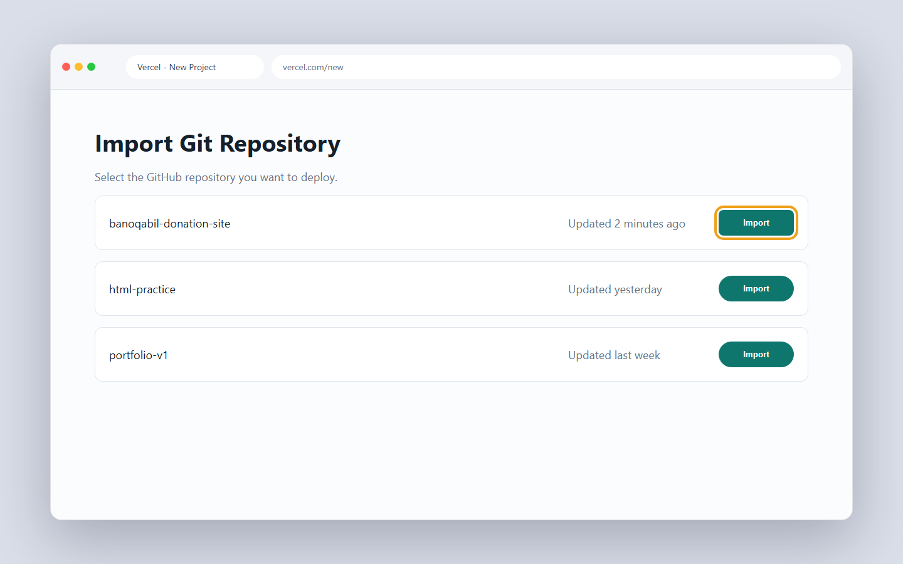
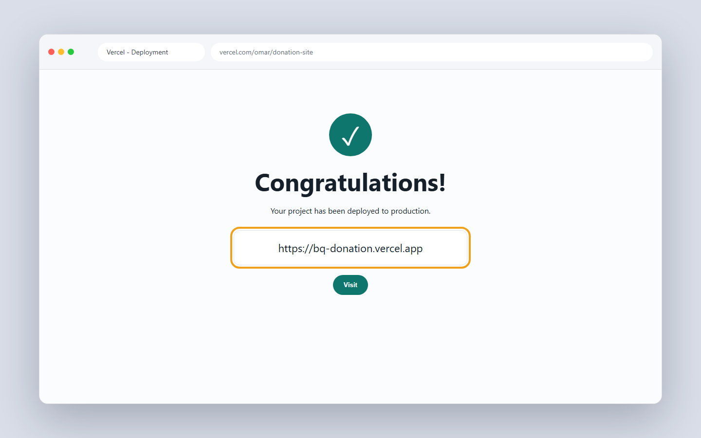
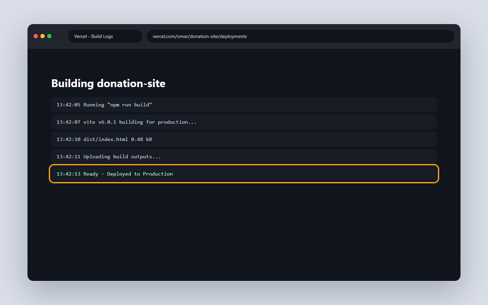

# 9.2 Vercel, the modern way

In 8.1 you learned what deployment means and how static sites work. Now you will use a real host. Vercel is a modern tool that connects to your GitHub repo and puts your site online. The best part is that one push to GitHub can update your live site by itself.

## What you'll know by the end

- How to create a free Vercel account using your GitHub login
- How to connect a GitHub repo and import it as a project
- What the build settings mean, like framework preset and output directory
- Why preview deployments give every push its own test URL
- How your main branch becomes the live production site
- How to deploy from the terminal with the Vercel CLI

---

## What Vercel is

Vercel is a hosting service made for frontend sites. It is git-connected. This means it watches your GitHub repo and reacts to changes.

When you push new code to GitHub, Vercel sees it and builds your site again. You do not upload files by hand. You just push to GitHub, and Vercel does the rest.

For a beginner, this feels like magic. You write code, you push, and your live site updates in seconds.

### How the GitHub-to-Vercel flow works

Here is what happens the moment you run `git push`.

<figure markdown>
<svg viewBox="0 0 820 240" xmlns="http://www.w3.org/2000/svg" role="img" aria-labelledby="svg-vercel-flow-title" style="max-width:100%;height:auto">
  <title id="svg-vercel-flow-title">The GitHub to Vercel auto-deploy flow: you push code to GitHub, GitHub sends a webhook to Vercel, Vercel pulls the code and runs the build, then publishes the live URL.</title>
  <g fill="#ffffff" stroke="#1f1f1c" stroke-width="1.5">
    <rect x="20" y="80" width="140" height="70" rx="8"/>
    <rect x="210" y="80" width="140" height="70" rx="8"/>
    <rect x="400" y="80" width="160" height="70" rx="8"/>
    <rect x="620" y="80" width="160" height="70" rx="8"/>
  </g>
  <g font-family="Inter, sans-serif" text-anchor="middle">
    <g font-size="13" font-weight="600" fill="#1f1f1c">
      <text x="90" y="111">Your machine</text>
      <text x="280" y="111">GitHub</text>
      <text x="480" y="111">Vercel build</text>
      <text x="700" y="111">Live URL</text>
    </g>
    <g font-size="11" fill="#6b6b65">
      <text x="90" y="132">git push</text>
      <text x="280" y="132">stores the commit</text>
      <text x="480" y="132">runs, outputs files</text>
      <text x="700" y="132">yourname.vercel.app</text>
    </g>
    <g font-size="10" fill="#6b6b65">
      <text x="185" y="76">push</text>
      <text x="373" y="76">webhook</text>
      <text x="563" y="76">deploy</text>
    </g>
  </g>
  <defs>
    <marker id="bq-arrow-vf" viewBox="0 0 10 10" refX="9" refY="5" markerWidth="6" markerHeight="6" orient="auto-start-reverse">
      <path d="M0 0 L10 5 L0 10 z" fill="currentColor"/>
    </marker>
  </defs>
  <g stroke="currentColor" stroke-width="1.5" fill="none" marker-end="url(#bq-arrow-vf)">
    <line x1="160" y1="115" x2="202" y2="115"/>
    <line x1="350" y1="115" x2="392" y2="115"/>
    <line x1="560" y1="115" x2="612" y2="115"/>
  </g>
</svg>
<figcaption>Every git push triggers a chain: GitHub stores the commit, sends a webhook to Vercel, Vercel builds the project, and the live URL updates in seconds.</figcaption>
</figure>

A **webhook** (Roman Urdu: ek automatic signal jo GitHub Vercel ko bhejta hai) is just a ping that GitHub sends to Vercel the moment you push. Vercel hears it and starts the build. You do not have to click anything.

---

## Creating a free account

Go to [vercel.com](https://vercel.com) and click Sign Up. You will see a few login options.

Pick "Continue with GitHub". This is the easiest path because Vercel and GitHub then talk to each other directly. You do not need a separate password.

GitHub will ask you to authorize Vercel. Click the green button to allow it. After that, you land on your Vercel dashboard.

!!! tip
    Sign in to Vercel with GitHub, not email. It links the two accounts at once and saves you setup time later.

---

## Connecting your GitHub repo

On your dashboard, click "Add New" and then "Project". Vercel shows a list of your GitHub repos.

The first time, Vercel may ask for permission to read your repos. You can give it access to all repos or just one. For now, allow access to the repo that holds your Chapter 5 donation site.

Find that repo in the list. Click the Import button next to it.



Click **Import** beside the repository you want to deploy. Make sure you choose the correct project, not an old practice repo.

??? note urdu "اردو میں مزید وضاحت"
    جب آپ اپنا گٹ ہب ریپو ورسل سے جوڑتے ہیں، تو ورسل کو آپ کے کوڈ کو پڑھنے کی اجازت درکار ہوتی ہے۔ پہلی بار ورسل آپ سے یہ اجازت مانگے گا۔ آپ صرف اسی ریپو تک رسائی دے سکتے ہیں جو آپ کو لائیو کرنا ہے۔ اجازت دینے کے بعد، ورسل آپ کے ریپو کی فہرست دکھاتا ہے۔ پھر آپ امپورٹ کے بٹن پر کلک کرکے اپنا پروجیکٹ شروع کرتے ہیں۔ ہر بار جب آپ GitHub پر push کریں گے، ورسل خود بخود نئی build چلائے گا۔

---

## The build settings, explained simply

After you import, Vercel shows a settings page. Do not panic. For a plain HTML site, the defaults are mostly fine.

Here are the parts that matter:

- **Framework preset.** This tells Vercel what kind of project you have. Your donation site is plain HTML, CSS, and JavaScript. So choose "Other". Later, when you build React or Vite projects, Vercel will detect them on its own.
- **Output directory.** This is the folder that holds your final files. For a plain static site, your files sit in the root of the repo. So you can leave this empty or set it to the root.
- **Build command.** A plain HTML site has no build step. You can leave this blank.

Click Deploy when you are ready.

---

## Environment variables, in short

Sometimes your code needs secret values. An example is an API key or a private token. You must never write these directly in your code.

Vercel gives you a safe place for them. In the project settings, there is an Environment Variables section. You add the secret there, in the dashboard, not in your files.

Recall `.gitignore` from 5.1. You hid secret files from git the same way. The idea here is the same. Secrets stay out of your code and out of GitHub.

!!! warning
    Never put passwords, API keys, or tokens inside your code. Anyone who reads your repo can steal them. Use Vercel environment variables and keep secret files in `.gitignore`, just like you learned in 5.1.

---

## Preview deployments

This is the feature that makes Vercel feel modern. Every branch and every push gets its own temporary URL.

Say you make a new branch to try a new button color. You push it. Vercel builds that branch and gives you a special preview link. You open it and test the change in private.

The live site stays untouched. Your main site is safe. Only when you merge the branch into main does the change go live.

This lets you test before you ship. You catch mistakes on a preview URL, not on the page your users see.

### Preview deployment versus production

| | Preview deployment | Production |
| --- | --- | --- |
| What triggers it | Any push to any branch | A push or merge to `main` |
| URL | A long random URL, e.g. `abc123.vercel.app` | Your stable URL, e.g. `yourname.vercel.app` |
| Who should see it | Just you, for testing | Everyone, your real users |
| Effect on live site | None | Updates the live site |
| How long it stays | Until you delete it or the project | Permanent while the project exists |

---

## The production URL

Your main branch is special. Vercel treats it as your production site.

When you push to main, Vercel updates the live site at an address like `yourname.vercel.app`. This is the real URL you share with friends and teachers.

So remember the rule. Preview branches get test URLs. The main branch gets the production URL.



The highlighted URL is the public link. This is the address you can share with your teacher, friends, or client.

---

## The Vercel CLI, briefly

You can also deploy from the terminal. Vercel has a command line tool. You do not need it for this lesson, but it is good to know.

First, install it once on your computer:

```bash
npm i -g vercel
```

The `-g` flag installs it globally. This means you can run the `vercel` command from any folder.

To deploy your current folder, run:

```bash
vercel
```

This pushes your site to Vercel from the terminal. It asks a few questions, then gives you a URL.

To run your site locally with Vercel's tools, use:

```bash
vercel dev
```

This starts a local server on your machine. You can test your site before you deploy it.

---

## Hands-on: deploy the donation site

Now you will put your Chapter 5 donation site online. Follow each step.

1. Make sure your donation site is in a GitHub repo. If not, push it from your terminal first.
2. Go to [vercel.com](https://vercel.com) and click Sign Up.
3. Choose "Continue with GitHub" and authorize Vercel.
4. On the dashboard, click "Add New", then "Project".
5. Find your donation site repo in the list. Click Import.
6. For Framework preset, choose "Other".
7. Leave the build command blank. Leave the output directory as the root.
8. Click Deploy.
9. Watch the build log run. Wait for the Ready status.
10. Click Visit to open your live site.



Wait for **Ready** before you share the link. If the build fails, open the log and read the first red error.

Your donation site is now live at a `yourname.vercel.app` address. Share that link. Anyone in the world can open it.

---

### Try this (20 minutes)

1. Open your donation site repository on GitHub.
2. Sign in to Vercel with GitHub.
3. Import the repository and deploy it.
4. Wait for the build to show **Ready**.
5. Open the live URL in a new browser tab.
6. Make one small text change locally, push to GitHub, and watch Vercel deploy again.

When the second deploy finishes, you have proved the whole GitHub-to-Vercel loop works.

---

## Knowledge check

Don't write anything down. Just see if you can answer these in your head. If you can't, scroll back up. That's what this section is for.

1. Why is "Continue with GitHub" the easiest way to sign up for Vercel?
2. Which framework preset do you pick for a plain HTML site, and why?
3. What is the difference between a preview deployment and the production URL?
4. Where do you store secret values, and where should you never put them?

---

## What's next

You now have a site live on Vercel. But Vercel is not the only host. In 8.3 you will try InfinityFree and cPanel, an older style of hosting that many Pakistani sites still use. It works in a very different way, so it is worth seeing.

[Next lesson: 8.3 InfinityFree and cPanel &rarr;](9-3-infinityfree-and-cpanel.md){ .next-lesson }

---

## Going deeper (optional)

These are for the curious. You don't need them to continue.

- [Vercel docs: Deploying](https://vercel.com/docs/deployments/overview)
- [Vercel docs: Vercel CLI](https://vercel.com/docs/cli)

<!-- The Mark Complete button is injected here automatically by the site template. -->
<!-- Glossary tooltips used in this lesson. -->
*[Vercel]: A modern host that connects to GitHub and deploys frontend sites. (Roman Urdu: aik modern host jo GitHub se jurta hai aur site live karta hai)
*[framework preset]: A setting that tells Vercel what kind of project you have. (Roman Urdu: aik setting jo Vercel ko batati hai ke aap ka project kis tarah ka hai)
*[output directory]: The folder that holds your final files to serve. (Roman Urdu: woh folder jis mein aap ki final files hoti hain)
*[environment variable]: A secret value you set in the dashboard, not in code. (Roman Urdu: aik secret value jo aap dashboard mein set karte hain, code mein nahi)
*[preview deployment]: A temporary URL for a branch or push, used for testing. (Roman Urdu: aik temporary URL jo testing ke liye hota hai)
*[production]: Your live main site that users actually visit. (Roman Urdu: aap ki live site jo log dekhte hain)
*[webhook]: An automatic signal sent from one service to another when something happens. (Roman Urdu: ek automatic signal jo ek service doosri ko bhejti hai)
