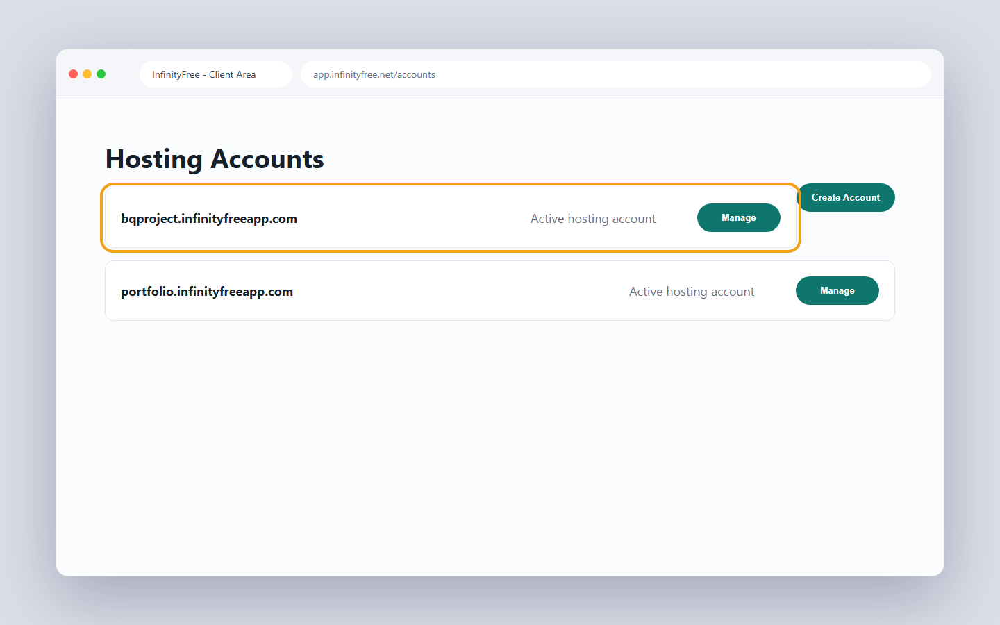
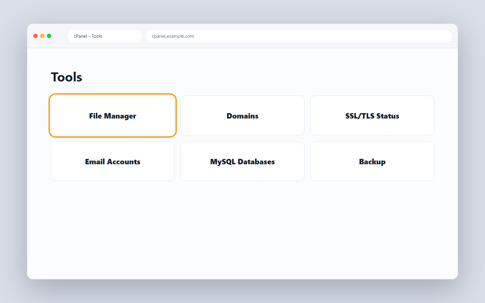
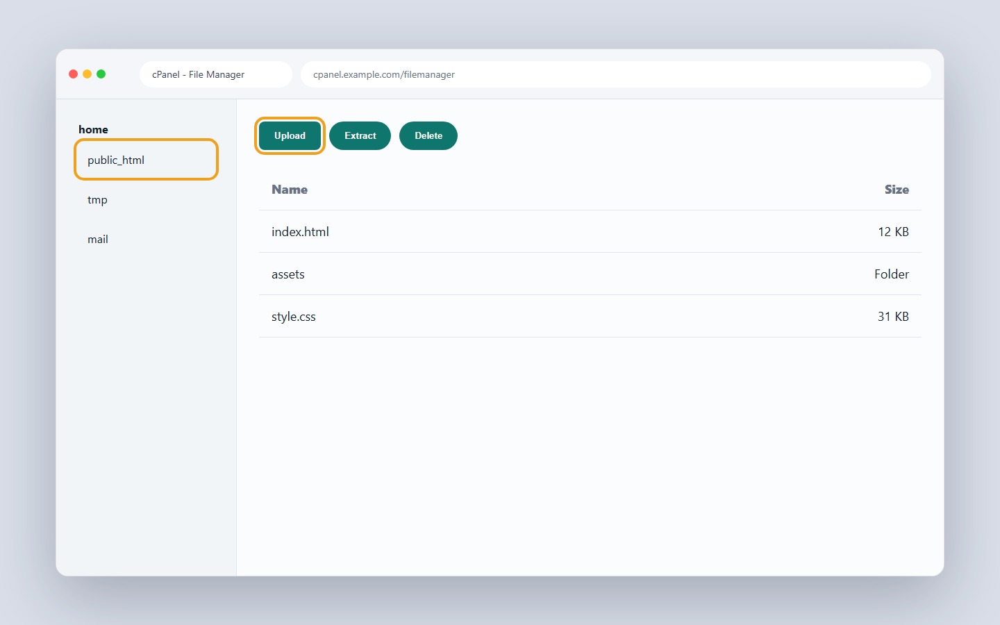
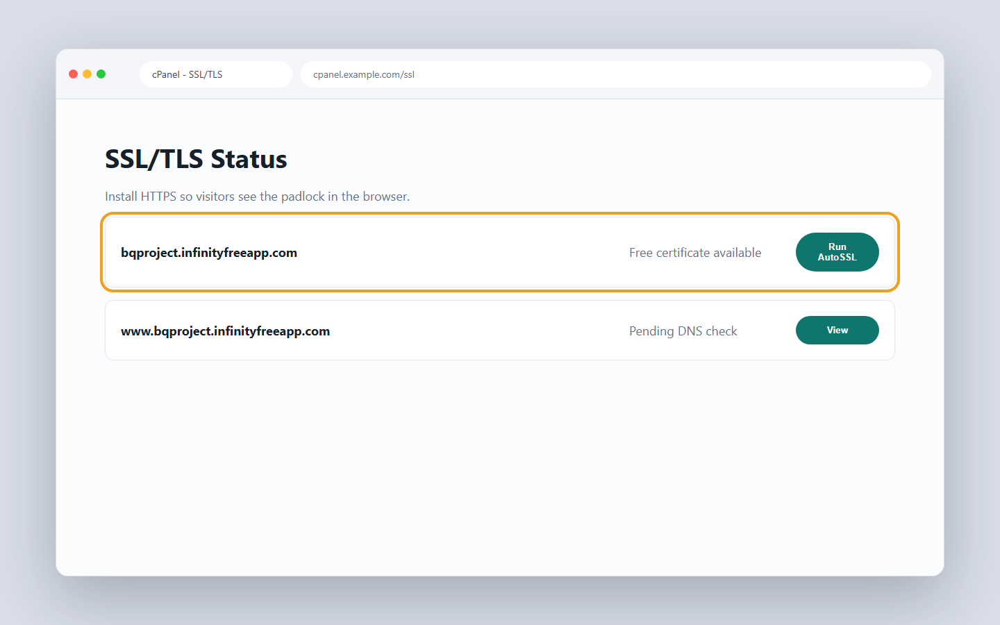

# 9.3 InfinityFree and cPanel

In 8.2 you put a site online with Vercel in a few clicks. That is the modern way. But many clients in Pakistan already pay for shared hosting from companies like Hostinger. They expect you to use a control panel called cPanel. So a freelancer meets cPanel again and again. Today you learn it for free.

## What you'll know by the end

- Why cPanel matters for freelance work in Pakistan.
- What shared hosting and cPanel actually are.
- How to make a free InfinityFree account to practice.
- How to upload your site through the File Manager.
- How to put your files in the right `public_html` folder.
- How to turn on free SSL so your site gets HTTPS.

---

## Why this matters here

Vercel is great for your own projects. But local clients work differently. Many of them buy a hosting plan from a company before they even hire you. These plans come with cPanel built in. The client gives you a login and says "put my site here."

If you only know Vercel, you get stuck. If you know cPanel too, you can take that job. This skill opens more freelance work for you.

!!! note "InfinityFree is for practice, not for a paying client"
    We use InfinityFree because it is free and it teaches you cPanel. But free shared hosting like this often goes slow or down for a few hours, and it has tight limits on busy days. That is normal for a free plan. For anything a client will actually use, move them to a paid Hostinger plan or to Vercel.

---

## What shared hosting and cPanel are

Shared hosting (Roman Urdu: ek hi server par bohat si websites jama karna) means many websites live on one big server. They share the same machine and split the cost. This makes it cheap, which is why budget hosts love it.

cPanel (Roman Urdu: website manage karne ka graphical control panel) is a control panel for that hosting. It gives you buttons and tiles for every common task. You can manage files, domains, email, and security from one screen. You do not need to type commands. You just click.

Think of cPanel as the dashboard of a car. You do not open the engine. You use the controls in front of you.

---

## The main sections of cPanel a freelancer uses

cPanel has dozens of tiles. You do not need them all. Here are the ones that come up on almost every client job.

| Section | What it does | When you use it |
| --- | --- | --- |
| **File Manager** | Upload, edit, and organise site files on the server | Every time you deploy or update a site |
| **Domains** | Connect a real domain name or add a subdomain | When the client has a domain to attach |
| **SSL/TLS** | Install a free certificate so the site runs on HTTPS | After you upload any site for a real user |
| **Email Accounts** | Create addresses like `info@theirsite.com` | When the client wants branded email |
| **Backup** | Download a copy of all site files | Before you make big changes to a live site |
| **MySQL Databases** | Create and manage a database | When the site uses PHP and needs stored data |

Learn the first four well and you can handle almost any small business site.

---

## How uploading to public_html works

Before you touch the dashboard, see the shape of what you are doing. Your files need to land inside a specific folder called `public_html`. The server watches that folder and serves whatever is inside it.

<figure markdown>
<svg viewBox="0 0 740 300" xmlns="http://www.w3.org/2000/svg" role="img" aria-labelledby="svg-cpanel-upload-title" style="max-width:100%;height:auto">
  <title id="svg-cpanel-upload-title">Uploading site files via cPanel File Manager: your zip file on your computer is uploaded to public_html, then extracted, so index.html sits directly inside public_html and the browser can serve it.</title>
  <g fill="#ffffff" stroke="#1f1f1c" stroke-width="1.5">
    <rect x="20" y="100" width="150" height="80" rx="8"/>
    <rect x="240" y="60" width="200" height="160" rx="8"/>
    <rect x="520" y="100" width="180" height="80" rx="8"/>
  </g>
  <g fill="#f4f4f1" stroke="#1f1f1c" stroke-width="1">
    <rect x="260" y="100" width="160" height="100" rx="4"/>
  </g>
  <g font-family="Inter, sans-serif" text-anchor="middle">
    <g font-size="13" font-weight="600" fill="#1f1f1c">
      <text x="95" y="133">Your computer</text>
      <text x="340" y="86">cPanel File Manager</text>
      <text x="610" y="133">Visitor browser</text>
    </g>
    <g font-size="11" fill="#6b6b65">
      <text x="95" y="153">site.zip</text>
      <text x="340" y="122">public_html/</text>
      <text x="340" y="142">  index.html</text>
      <text x="340" y="158">  style.css</text>
      <text x="340" y="174">  script.js</text>
      <text x="610" y="153">opens your site</text>
    </g>
    <g font-size="10" fill="#6b6b65">
      <text x="192" y="123">upload + extract</text>
      <text x="488" y="123">serves files</text>
    </g>
  </g>
  <defs>
    <marker id="bq-arrow-cp" viewBox="0 0 10 10" refX="9" refY="5" markerWidth="6" markerHeight="6" orient="auto-start-reverse">
      <path d="M0 0 L10 5 L0 10 z" fill="currentColor"/>
    </marker>
  </defs>
  <g stroke="currentColor" stroke-width="1.5" fill="none" marker-end="url(#bq-arrow-cp)">
    <line x1="170" y1="140" x2="232" y2="140"/>
    <line x1="440" y1="140" x2="512" y2="140"/>
  </g>
</svg>
<figcaption>You zip your site files, upload the zip into the public_html folder in File Manager, extract it there, and the server immediately serves those files to visitors.</figcaption>
</figure>

The most important rule is: your `index.html` must sit directly inside `public_html`, not inside a sub-folder inside it. If the structure is `public_html/my-site/index.html`, visitors see a blank page because the server does not know to look inside `my-site`.

---

## Make a free InfinityFree account

You do not need to buy hosting to practice. InfinityFree gives you free shared hosting with cPanel style tools. It is perfect for learning.

1. Open `infinityfree.com` in Chrome.
2. Click the sign up button.
3. Enter your email and a password.
4. Confirm your email from the message they send you.
5. Log in to your new client dashboard.

The hosting account is the space where your files will live. The login account is only the door into that space.

---

## Create a hosting account inside it

Your account is just the login. Now you make the actual hosting space for your site.

1. Click the option to create a new hosting account.
2. Choose the free subdomain option.
3. Pick a name, for example `mysite.infinityfree.app`.
4. Set a password for this hosting account.
5. Wait a minute while it gets ready.

A subdomain (Roman Urdu: muft web address bina domain khareede) is a free web address you get without buying a domain name. It is good enough for practice.

---

## Access the control panel

Once the hosting account is ready, you can open its control panel.

1. Find your hosting account in the dashboard.
2. Click the button to open the control panel.
3. The cPanel main page loads with many tiles.

Look around. You will see tiles for File Manager, SSL, domains, and email. Each tile is one tool.

Most beginner static sites only need a few cPanel tools. Start with **File Manager**.

---

## Upload your site with File Manager

This is the main job. You move your site files onto the server. The fastest way is to zip your site, upload the zip, and extract it.

First, on your computer, select your site files. Then zip them into one file. Right click and choose "Send to" and "Compressed (zipped) folder."

Now upload it:

1. Click the File Manager tile.
2. Open the `public_html` folder. On some hosts it is called `htdocs`.
3. Click the Upload button.
4. Select your zip file and let it upload.
5. Go back to `public_html` and find your zip there.
6. Right click the zip and choose Extract.
7. Delete the zip after it extracts, to keep things clean.

The most important rule is here. Your files must sit directly inside `public_html`. If you extract into a subfolder, the site will not show.

Open `public_html` before uploading. Your `index.html` should sit directly inside this folder.

!!! tip
    Your `index.html` must sit directly inside `public_html`. If it hides inside an extra folder, the page shows blank. Open `public_html` and you should see your `index.html` right there.

---

## Install free SSL for HTTPS

Right now your site may load on `http://`, which is not secure. You want `https://`. For that you need an SSL certificate (Roman Urdu: security file jo HTTPS aur padlock deti hai). cPanel can give you one for free.

1. Go back to the cPanel main page.
2. Find the SSL/TLS section and open it.
3. Look for a free certificate option.
4. Request or install the certificate for your subdomain.
5. Wait a short while for it to activate.

After this, your site loads with the padlock in the address bar. Visitors trust a padlock.

After SSL is active, test the site with `https://` in the address bar and look for the padlock.

---

## The cPanel basics a freelancer needs

You do not need every tile. A few tools cover most client work.

- File Manager: upload and edit your site files.
- Domains: connect a real domain name to the site.
- SSL/TLS: turn on HTTPS with a certificate.
- Email accounts: make addresses like `info@theirsite.com`.

Learn these four well. You can handle most small business sites with them.

!!! warning
    Free shared hosting can be slow and may show ads on your page. That is fine for practice. For a real client, use a paid host or use Vercel. Do not hand a client a site full of ads.

---

## Vercel versus cPanel

Both ways are valid. They just suit different jobs.

| | Vercel | cPanel (shared hosting) |
| --- | --- | --- |
| How you update the site | Push to GitHub, auto-deploys | Upload files by hand in File Manager |
| Setup effort | Low, link GitHub once | Medium, manage files manually |
| Git connected | Yes | No |
| Who you use it for | Your own projects | Clients who already pay for cPanel hosting |
| Free option | Yes, generous | Yes, InfinityFree (with limits) |
| Email on the domain | Via third party only | Built in |
| Common in Pakistan | Growing | Very common |

Use Vercel for your own modern projects. Use cPanel when a client already pays for shared hosting and asks for it.

??? note urdu "اردو میں مزید وضاحت"
    سب سے اہم بات یہ ہے کہ آپ کی سائٹ کی فائلیں سیدھی public_html فولڈر کے اندر ہونی چاہئیں۔ اگر آپ فائلوں کو کسی اور فولڈر کے اندر رکھ دیں گے تو سائٹ خالی نظر آئے گی۔ زپ فائل اپلوڈ کرنے کے بعد اسے public_html کے اندر ہی کھولیں۔ پھر دیکھیں کہ آپ کی index.html فائل اسی فولڈر میں سامنے موجود ہے۔ ورسل میں ہر بار کوڈ پش کرنے پر سائٹ خود بخود اپڈیٹ ہو جاتی ہے، جبکہ cPanel میں آپ کو ہر بار خود فائلیں اپلوڈ کرنی پڑتی ہیں۔ یہی دونوں طریقوں کا بڑا فرق ہے۔

---

### Try this (15 minutes)

1. Make a tiny static site with `index.html` and `style.css`.
2. Zip only those files, not the parent folder.
3. In your notes, write the upload path: `public_html/index.html`.
4. If you have access to cPanel, upload and extract the zip inside `public_html`.
5. Open the site URL and check that the page loads.

If you do not have hosting access today, still do steps 1 to 3. The folder habit matters.

---

## Knowledge check

Don't write anything down. Just see if you can answer these in your head. If you can't, scroll back up. That's what this section is for.

1. What is shared hosting in simple words?
2. Which folder must hold your site files directly?
3. Why do you request a free SSL certificate?
4. How is uploading on cPanel different from deploying on Vercel?

---

## What's next

You now know two ways to put a site online. In 8.4 you meet a few more, like Netlify and GitHub Pages, plus paid hosts like Hostinger. Then you learn how to choose the right host for each job.

[Next lesson: 8.4 Choosing your host &rarr;](9-4-netlify-pages-hostinger-and-choosing.md){ .next-lesson }

---

## Going deeper (optional)

These are for the curious. You don't need them to continue.

- [InfinityFree Knowledge Base](https://forum.infinityfree.com/docs)
- [Hostinger: What is cPanel](https://www.hostinger.com/tutorials/what-is-cpanel)

<!-- The Mark Complete button is injected here automatically by the site template. -->
<!-- Glossary tooltips used in this lesson. -->
*[shared hosting]: Many websites living on one shared server to keep the cost low. (Roman Urdu: ek hi server par bohat si websites, sasta hota hai)
*[cPanel]: A control panel with tiles and buttons to manage a website on a server. (Roman Urdu: website manage karne ka control panel)
*[File Manager]: The cPanel tool for uploading and editing your site files. (Roman Urdu: files upload aur edit karne ka tool)
*[public_html]: The folder where your site files must sit so the site shows. (Roman Urdu: woh folder jahan site ki files honi chahiye)
*[SSL certificate]: A security file that lets your site load on HTTPS with a padlock. (Roman Urdu: security file jo HTTPS aur padlock deti hai)
*[subdomain]: A free web address you get without buying a domain name. (Roman Urdu: muft web address bina domain khareede)
