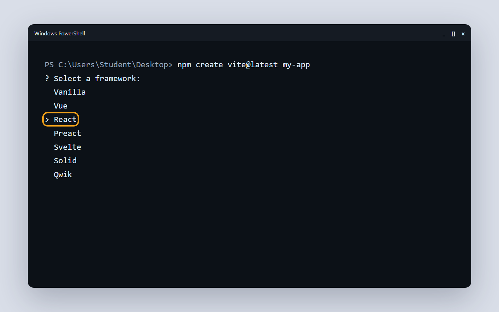
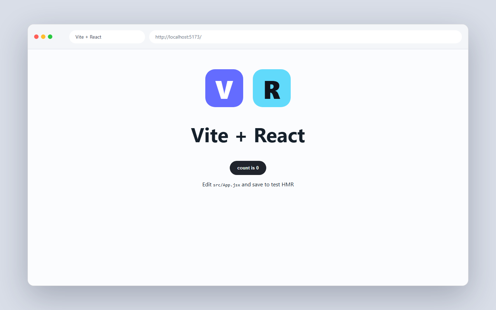
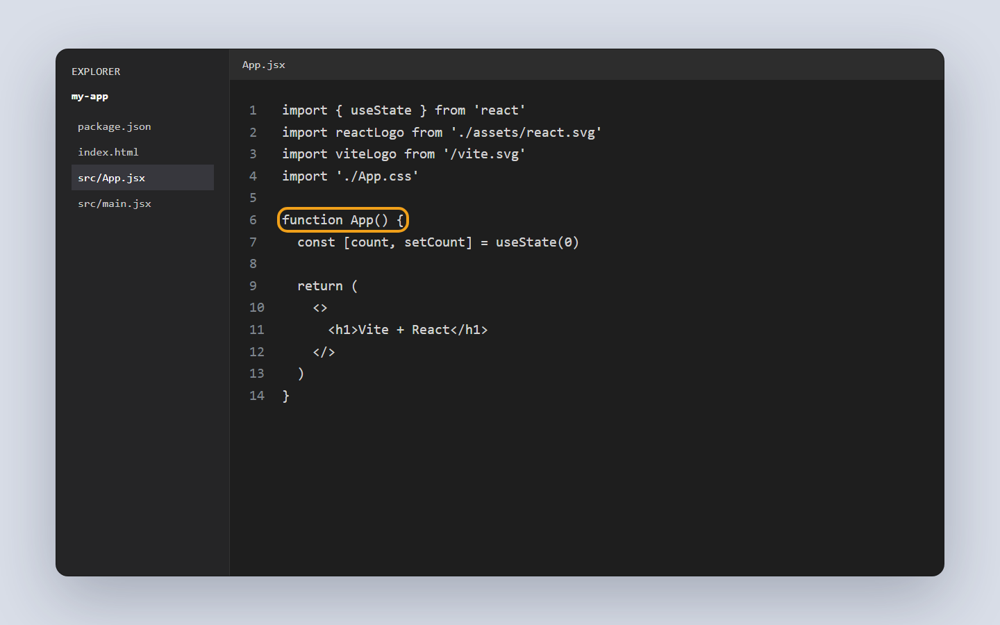

# 10.1 Why React, Vite, and JSX

In Chapter 8 you changed the page with plain JavaScript and the DOM. That worked for small pages. As a page grows, all that manual DOM work gets messy. React is a tool that handles screen updates for you. This is your first step into building with React.

## What you'll know by the end

- What React is and why people use it.
- How React relates to the plain JavaScript you already know.
- How to create a new React project with Vite.
- What each main file in the project does.
- What JSX is and its key rules.
- How to write and use your first component.

---

## What React is

React is a JavaScript library for building user interfaces. You build the screen out of small pieces called components (Roman Urdu: components - page ke chhote chhote hisse). A component is one piece of the page, like a button, a card, or a header.

React exists to make hard pages easier. Think back to lesson 8.3. You wrote code to find an element, then change its text, then update it again later. With one or two elements that is fine. With fifty elements that becomes a tangle.

React fixes this in two ways. First, when your data changes, React updates the screen for you. You do not write DOM update code by hand. Second, you can reuse one component many times. Write a card once, then show it ten times with different data.

Here is the calm part. React is still just JavaScript. Functions, arrays, objects, and the things you learned still apply. React adds a new way to organize them, not a new language.

---

## Why not plain JavaScript?

You could keep using plain JavaScript and the DOM. For a page with two or three interactive things, that is fine. But here is what happens as the page grows.

Imagine a shopping page. You have a product list, a cart icon that shows the count, a total price at the bottom, and a "sold out" badge on each card. When the user adds a product, you must update four parts of the page. You call `getElementById` four times. You set `textContent` four times. If any one step is wrong, the page shows stale data.

React replaces all of that. You describe what the page should look like for a given set of data. When data changes, React figures out what to update and does it.

| Approach | How you update the screen | What you write |
| --- | --- | --- |
| Plain JS + DOM | You call `getElementById`, set `textContent` yourself | Imperative: "do this, then do that" |
| React | You describe the UI; React updates the DOM | Declarative: "this is what it should look like" |
| jQuery (older) | Helpers that shorten DOM calls, still manual | Imperative with shortcuts |
| Vue / Svelte | Similar idea to React, different syntax | Declarative, component-based |

React is the most widely used of these today. Learning it opens doors to many job listings and open source projects.

---

## From JSX to what the browser sees

When you write JSX, the browser never sees it directly. A build tool transforms your JSX into plain JavaScript calls. Those calls build the DOM. Here is the shape of that journey.

<figure markdown>
<svg viewBox="0 0 720 220" xmlns="http://www.w3.org/2000/svg" role="img" aria-labelledby="svg-jsx-compile" style="max-width:100%;height:auto">
  <title id="svg-jsx-compile">JSX you write compiles to React.createElement calls, which React uses to build a virtual DOM, and then the browser shows real HTML.</title>
  <g fill="#ffffff" stroke="#1f1f1c" stroke-width="1.5">
    <rect x="20" y="70" width="150" height="80" rx="8"/>
    <rect x="220" y="70" width="150" height="80" rx="8"/>
    <rect x="420" y="70" width="150" height="80" rx="8"/>
    <rect x="580" y="70" width="120" height="80" rx="8"/>
  </g>
  <g font-family="Inter, sans-serif" font-size="12" fill="#1f1f1c" text-anchor="middle">
    <text x="95" y="95">Your JSX file</text>
    <text x="95" y="113">src/App.jsx</text>
    <text x="95" y="131">&lt;h1&gt;Hello&lt;/h1&gt;</text>
  </g>
  <g font-family="Inter, sans-serif" font-size="12" fill="#1f1f1c" text-anchor="middle">
    <text x="295" y="95">Vite + Babel</text>
    <text x="295" y="113">compiles to</text>
    <text x="295" y="131">createElement()</text>
  </g>
  <g font-family="Inter, sans-serif" font-size="12" fill="#1f1f1c" text-anchor="middle">
    <text x="495" y="95">React Virtual</text>
    <text x="495" y="113">DOM (JS object</text>
    <text x="495" y="131">in memory)</text>
  </g>
  <g font-family="Inter, sans-serif" font-size="12" fill="#1f1f1c" text-anchor="middle">
    <text x="640" y="95">Real DOM</text>
    <text x="640" y="113">in the</text>
    <text x="640" y="131">browser</text>
  </g>
  <g font-family="Inter, sans-serif" font-size="11" fill="#6b6b65" text-anchor="middle">
    <text x="95" y="170">you write this</text>
    <text x="295" y="170">build step</text>
    <text x="495" y="170">React manages</text>
    <text x="640" y="170">user sees this</text>
  </g>
  <defs>
    <marker id="arr-jsx" viewBox="0 0 10 10" refX="9" refY="5" markerWidth="6" markerHeight="6" orient="auto-start-reverse">
      <path d="M0 0 L10 5 L0 10 z" fill="currentColor"/>
    </marker>
  </defs>
  <g stroke="currentColor" stroke-width="1.5" fill="none" marker-end="url(#arr-jsx)">
    <line x1="172" y1="110" x2="218" y2="110"/>
    <line x1="372" y1="110" x2="418" y2="110"/>
    <line x1="572" y1="110" x2="578" y2="110"/>
  </g>
</svg>
<figcaption>JSX is transformed by Vite and Babel into plain JavaScript. React keeps a virtual DOM in memory. When data changes, React compares the old and new virtual DOM and only updates the parts that actually changed.</figcaption>
</figure>

The virtual DOM is the clever part. React keeps a lightweight copy of the page in memory. When your state changes, React builds a new virtual copy and compares it to the old one. Only the actual differences get applied to the real DOM. This is much faster than replacing entire blocks of HTML.

---

## Create a project with Vite

Vite (Roman Urdu: ek build tool jo React project banata aur chalata hai) is a build tool. It sets up a React project for you and runs a fast local server. You already have Node and VS Code from lesson 1.2.

Open a terminal and run this command.

```bash
npm create vite@latest my-app
```

Vite will ask you some questions. First it asks for a framework. Choose **React**. Next it asks for a variant. Choose **JavaScript**, not TypeScript. You will learn TypeScript later.



Use the arrow keys to select **React**, then press Enter.

Now move into the new folder, install the packages, and start the server.

```bash
cd my-app
npm install
npm run dev
```

The `cd my-app` command moves you inside the project folder. The `npm install` command downloads the code React needs. The `npm run dev` command starts the local server.

After it starts, you will see a local URL in the terminal. It is usually `http://localhost:5173`. Hold Ctrl and click the link, or paste it into your browser.



This page means the local dev server is working. Keep the terminal open while you code.

!!! tip
    While you are learning, always choose React and JavaScript in the Vite prompts. TypeScript is useful, but it adds rules that slow down a beginner. Add it once React feels natural.

---

## A tour of the project files

Open the `my-app` folder in VS Code. You will see several files and folders. Here is a map of the ones that matter.

<figure markdown>
<svg viewBox="0 0 540 360" xmlns="http://www.w3.org/2000/svg" role="img" aria-labelledby="svg-vite-folder" style="max-width:100%;height:auto">
  <title id="svg-vite-folder">Vite project folder structure: my-app at the top, with node_modules, public, src, index.html, and package.json underneath. Inside src are main.jsx, App.jsx, and App.css.</title>
  <g fill="#ffffff" stroke="#1f1f1c" stroke-width="1.5">
    <rect x="190" y="10" width="160" height="36" rx="6"/>
    <rect x="30" y="90" width="140" height="36" rx="6" stroke-dasharray="5 3"/>
    <rect x="190" y="90" width="100" height="36" rx="6"/>
    <rect x="310" y="90" width="80" height="36" rx="6"/>
    <rect x="400" y="90" width="110" height="36" rx="6"/>
    <rect x="60" y="210" width="120" height="36" rx="6"/>
    <rect x="200" y="210" width="110" height="36" rx="6"/>
    <rect x="330" y="210" width="110" height="36" rx="6"/>
  </g>
  <g font-family="Inter, monospace, sans-serif" font-size="12" fill="#1f1f1c" text-anchor="middle">
    <text x="270" y="34">my-app/</text>
  </g>
  <g font-family="Inter, monospace, sans-serif" font-size="11" fill="#6b6b65" text-anchor="middle">
    <text x="100" y="113">node_modules/</text>
  </g>
  <g font-family="Inter, monospace, sans-serif" font-size="11" fill="#1f1f1c" text-anchor="middle">
    <text x="240" y="106">public/</text>
    <text x="240" y="120">static assets</text>
    <text x="350" y="106">src/</text>
    <text x="350" y="120">your code</text>
    <text x="455" y="106">index.html</text>
    <text x="455" y="120">+package.json</text>
  </g>
  <g font-family="Inter, monospace, sans-serif" font-size="11" fill="#1f1f1c" text-anchor="middle">
    <text x="120" y="228">main.jsx</text>
    <text x="120" y="242">entry point</text>
    <text x="255" y="228">App.jsx</text>
    <text x="255" y="242">root component</text>
    <text x="385" y="228">App.css</text>
    <text x="385" y="242">starter styles</text>
  </g>
  <g font-family="Inter, sans-serif" font-size="10" fill="#6b6b65" text-anchor="middle">
    <text x="100" y="145">auto-generated,</text>
    <text x="100" y="157">do not edit</text>
    <text x="120" y="300">connects app</text>
    <text x="120" y="312">to index.html div</text>
    <text x="255" y="300">starter page</text>
    <text x="255" y="312">you will edit this</text>
    <text x="385" y="300">delete or replace</text>
    <text x="385" y="312">with your own</text>
  </g>
  <g stroke="#1f1f1c" stroke-width="1" fill="none">
    <line x1="270" y1="46" x2="270" y2="70"/>
    <line x1="100" y1="70" x2="455" y2="70"/>
    <line x1="100" y1="70" x2="100" y2="90"/>
    <line x1="240" y1="70" x2="240" y2="90"/>
    <line x1="350" y1="70" x2="350" y2="90"/>
    <line x1="455" y1="70" x2="455" y2="90"/>
    <line x1="350" y1="126" x2="350" y2="190"/>
    <line x1="120" y1="190" x2="385" y2="190"/>
    <line x1="120" y1="190" x2="120" y2="210"/>
    <line x1="255" y1="190" x2="255" y2="210"/>
    <line x1="385" y1="190" x2="385" y2="210"/>
  </g>
</svg>
<figcaption>A new Vite + React project. You will spend almost all your time inside the src folder. The node_modules folder is auto-generated; leave it alone.</figcaption>
</figure>

Here is what each important file does.

| File | What it does | Do you edit it? |
| --- | --- | --- |
| `index.html` | The one HTML page that loads the whole app. Holds an empty `div` where React mounts. | Rarely |
| `src/main.jsx` | The entry point. Connects your root component to the `div` in `index.html`. | Rarely |
| `src/App.jsx` | The root component. The starter page lives here. | Yes, early on |
| `package.json` | Lists project name, scripts like `npm run dev`, and dependencies. | Rarely, by hand |
| `node_modules/` | All downloaded packages. Created by `npm install`. Never touch by hand. | Never |



The highlighted `App` function is the root component. Most beginners make their first changes here.

---

## What JSX is

Open `src/App.jsx` and you will see HTML-like code inside a JavaScript file. That is JSX (Roman Urdu: JavaScript ke andar HTML jaisi likhai). JSX lets you write tags that look like HTML right inside your JavaScript.

JSX is not real HTML. It only looks like it. So it has a few rules you must follow.

- Use `className` instead of `class` for CSS classes.
- You must return ONE root element. To wrap many elements, use a fragment, which is `<>...</>`.
- Put JavaScript expressions inside curly braces `{}`.
- Close every tag. Even single tags, like `` and `<br />`.

Here is a small example of those rules together.

```jsx
function Profile() {
  const name = "Ayesha";

  return (
    <>
      <h1 className="title">Hello {name}</h1>
      
    </>
  );
}
```

The `className` sets the CSS class. The `<>` and `</>` are the fragment that wraps two elements. The `{name}` shows the value of the variable. The `` closes itself.

Here is a table of the most common JSX differences from HTML.

| In HTML | In JSX | Why it changed |
| --- | --- | --- |
| `class="card"` | `className="card"` | `class` is a reserved word in JavaScript |
| `for="email"` | `htmlFor="email"` | `for` is also reserved in JavaScript |
| `<br>` | `<br />` | JSX requires every tag to close |
| `` | `` | same, self-close single tags |
| `onclick="fn()"` | `onClick={fn}` | camelCase, pass a function reference |
| `style="color:red"` | `style={{ color: "red" }}` | style takes a JS object in JSX |

!!! warning
    Two errors hit almost every beginner. First, writing `class` instead of `className`. Second, returning two elements without a wrapper. Always use `className`, and always return one root element or a fragment.

---

## Your first component

A component is a JavaScript function that returns JSX. The name must start with a capital letter. This is how React tells your components apart from normal HTML tags.

Create a small component called `Welcome`.

```jsx
function Welcome() {
  return <h2>Welcome to React</h2>;
}
```

Now use it inside `App`. You use a component like a tag, written as `<Welcome />`.

```jsx
function App() {
  return (
    <div>
      <h1>My First App</h1>
      <Welcome />
    </div>
  );
}

export default App;
```

The `<Welcome />` line runs your function and shows its JSX. Notice that `App` returns one `div` that wraps everything inside. Save the file, and your browser updates on its own.

### Try this

In your Vite project, open `src/App.jsx`. Write a new component called `Footer` that returns a single line, like `<p>Built with React</p>`. Then use it inside `App` below the `<Welcome />` tag, written as `<Footer />`. Save and check that your line shows in the browser. As a small extra, change the text inside `Welcome` and watch the page update on its own.

---

!!! note "A note on nizam"
    React asks you to split a page into small, ordered pieces. Each component does
    one job. This nizam, a sense of order, keeps a big app from becoming chaos. A
    tidy structure is easier to read, fix, and trust.

---

??? note urdu "اردو میں مزید وضاحت"
    React ایک JavaScript library ہے جو آپ کے لیے screen خود اپڈیٹ کرتی ہے۔ آپ کو DOM کو ہاتھ سے نہیں بدلنا پڑتا۔ Vite ایک build tool ہے جو project بناتا اور چلاتا ہے۔ JSX وہ syntax ہے جو JavaScript کے اندر HTML جیسی لکھائی دیتا ہے۔ کمپوننٹ ایک function ہوتا ہے جو JSX واپس کرتا ہے، اور اس کا نام ہمیشہ بڑے حرف سے شروع ہوتا ہے۔ `className` یاد رکھیں، نہ کہ `class`، کیونکہ `class` JavaScript میں پہلے سے مخصوص لفظ ہے۔

---

## Knowledge check

Don't write anything down. Just see if you can answer these in your head. If you can't, scroll back up. That's what this section is for.

1. Why does React make a growing page easier than plain DOM code?
2. In the Vite prompts, which framework and which variant should you choose?
3. What two JSX rules cause the most common beginner errors?
4. What three things make a function a React component?

---

## What's next

You now know how to make a project and write one component. In the next lesson, you will build more components and pass data into them. That data passing is called props, and it makes components flexible.

[Next lesson: 10.2 Components and props &rarr;](10-2-components-and-props.md){ .next-lesson }

---

## Going deeper (optional)

These are for the curious. You don't need them to continue.

- [react.dev Quick Start](https://react.dev/learn)
- [Vite Getting Started](https://vite.dev/guide/)

<!-- The Mark Complete button is injected here automatically by the site template. -->
<!-- Glossary tooltips used in this lesson. -->
*[React]: A JavaScript library for building user interfaces from components. (Roman Urdu: ek JavaScript library jo components se UI banati hai)
*[library]: A set of ready-made code you use in your own project. (Roman Urdu: tayar code ka set jo aap apne project mein istemal karte hain)
*[component]: A reusable piece of the page, written as a function that returns JSX. (Roman Urdu: page ka ek chota hissa jo baar baar istemal ho sakta hai, jaise ek card ya button)
*[JSX]: HTML-like syntax you write inside JavaScript. (Roman Urdu: JavaScript ke andar HTML jaisi likhai)
*[Vite]: A build tool that sets up and runs your React project. (Roman Urdu: ek build tool jo React project banata aur chalata hai)
*[dev server]: The local server that shows your app while you build it. (Roman Urdu: local server jo banate waqt app dikhata hai)
*[virtual DOM]: React's lightweight in-memory copy of the page, used to calculate the minimum updates needed. (Roman Urdu: React ka memory mein rakha page ka copy jo sirf zaruri changes karta hai)
