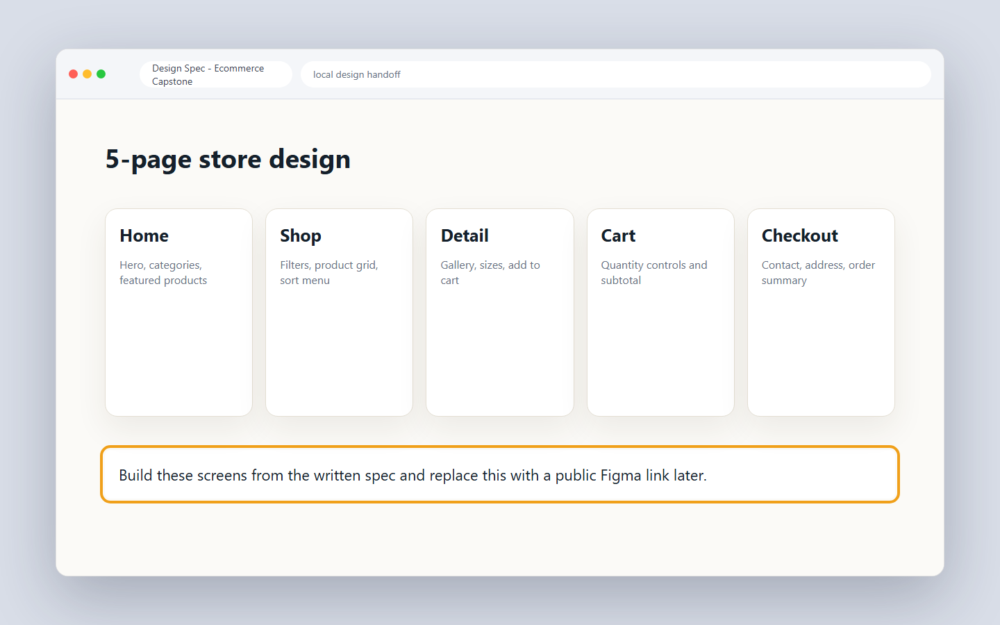

# 13.1 Planning and scaffolding

You learned a lot of small skills across eleven chapters. Now you join them into one real project. You will build an ecommerce store, the kind of site people use to buy clothes online. In this lesson you plan the build and set up an empty project that is ready to grow.

## What you'll know by the end

- The five pages your store needs and what each page shows.
- How to read the Figma design and turn it into a build plan.
- How to scaffold a new Vite, React, and Tailwind project.
- A real-app folder structure and what each folder holds.
- How to install React Router and add a route for every page.
- How to write a product data model your whole app can read.

---

## What you are building

You are building a small ecommerce store with five pages. Each page has one clear job.

- **Home**: the front door. It shows a hero, a few featured products, and links into the store.
- **Shop**: the full product list. People browse and filter products here.
- **Product detail**: one product up close. It shows the image, price, sizes, colors, and a button to add to the cart.
- **Cart**: the items a person picked. It shows quantities and the total price.
- **Checkout**: the final step. A form to enter shipping and payment details.

You will not handle real money. This is a front-end build, so the checkout is a form only. The data stays on the user's machine.

### How the five pages connect

It helps to see the pages as a map before you build anything. A shopper starts at Home, can jump to Shop, drills into a Product, adds it to the Cart, and finishes at Checkout. Some paths go backward too: the cart links back to the shop.

<figure markdown>
<svg viewBox="0 0 740 260" xmlns="http://www.w3.org/2000/svg" role="img" aria-labelledby="svg-route-map" style="max-width:100%;height:auto">
  <title id="svg-route-map">Route map of the five store pages. Home connects to Shop and to Product Detail. Shop connects to Product Detail. Product Detail connects to Cart. Cart connects to Shop and to Checkout.</title>
  <defs>
    <marker id="arr1" viewBox="0 0 10 10" refX="9" refY="5" markerWidth="7" markerHeight="7" orient="auto-start-reverse">
      <path d="M0 0 L10 5 L0 10 z" fill="currentColor"/>
    </marker>
  </defs>
  <g fill="#ffffff" stroke="#1f1f1c" stroke-width="1.5">
    <rect x="20" y="100" width="110" height="42" rx="6"/>
    <rect x="200" y="100" width="110" height="42" rx="6"/>
    <rect x="380" y="30" width="120" height="42" rx="6"/>
    <rect x="380" y="168" width="120" height="42" rx="6"/>
    <rect x="570" y="100" width="110" height="42" rx="6"/>
  </g>
  <g font-family="Inter, sans-serif" font-size="13" fill="#1f1f1c" text-anchor="middle">
    <g>
      <text x="75" y="116">Home</text>
      <text x="75" y="132">path="/"</text>
    </g>
    <g>
      <text x="255" y="116">Shop</text>
      <text x="255" y="132">path="/shop"</text>
    </g>
    <g>
      <text x="440" y="46">Product</text>
      <text x="440" y="62">path="/product/:id"</text>
    </g>
    <g>
      <text x="440" y="184">Cart</text>
      <text x="440" y="200">path="/cart"</text>
    </g>
    <g>
      <text x="625" y="116">Checkout</text>
      <text x="625" y="132">path="/checkout"</text>
    </g>
  </g>
  <g stroke="currentColor" stroke-width="1.5" fill="none" marker-end="url(#arr1)">
    <line x1="130" y1="121" x2="198" y2="121"/>
    <line x1="310" y1="110" x2="378" y2="65"/>
    <line x1="310" y1="132" x2="378" y2="177"/>
    <line x1="255" y1="142" x2="255" y2="210" />
    <line x1="255" y1="210" x2="378" y2="210" />
    <path d="M500 189 Q540 189 540 121 L570 121" fill="none"/>
    <line x1="440" y1="72" x2="440" y2="166"/>
  </g>
</svg>
<figcaption>The five pages form a one-way shopping flow: Home to Shop to Product, then into Cart, and finally Checkout. Cart can also send a shopper back to the Shop.</figcaption>
</figure>

Think of this map as your project spec. Every route in `App.jsx` matches one box, and every link in the UI matches one arrow.

### React Router routes at a glance

Here is the same information as a table so you can scan it while you code.

| Path | Component file | What it shows |
| --- | --- | --- |
| `/` | `pages/Home.jsx` | Hero, featured products, testimonial, footer |
| `/shop` | `pages/Shop.jsx` | All products, filter sidebar, search input |
| `/product/:id` | `pages/ProductDetail.jsx` | One product, size/color picker, Add to Cart |
| `/cart` | `pages/Cart.jsx` | Cart items, quantities, totals, Checkout link |
| `/checkout` | `pages/Checkout.jsx` | Shipping form, order summary, Place Order |

The `:id` segment is dynamic. React Router fills it with the real number from the URL, so one component handles every product.

---

## Reading the design

A real project starts from a design, not from code. The design tells you the layout, colors, spacing, and fonts. Your job is to copy it closely in code.

The design spec gives you the layout, spacing, and page list before you write anything. Look at the five pages. Notice the spacing between elements and the size of the text. Pick out the colors. A few minutes of reading saves you an hour of guessing later.



Use this local spec and the page descriptions in this chapter. If your teacher later gives you a public Figma file, use that file as the source of truth for exact colours, spacing, and text sizes.

When you read the design, write a short plan for each page. List the sections from top to bottom. This plan becomes your checklist while you code.

!!! tip
    Build the whole skeleton before you style anything. Make one empty page per route first. Put a single heading on each page, like `<h1>Shop</h1>`. Once you can click between all five pages, then you start styling. This stops you from getting stuck on one pretty page while the rest does not work.

---

## Scaffolding the project

Scaffolding (Roman Urdu: project ka khaali dhaancha banana) means setting up the empty project. You did this in lessons 5.1 and 10.1. Here is the same flow again.

Open your terminal in the folder where you keep projects. Then run these commands.

```bash
npm create vite@latest bq-store -- --template react
cd bq-store
npm install
npm install tailwindcss @tailwindcss/vite
npm install react-router-dom
```

The first command makes a new React project named `bq-store`. The second moves you into it. The third downloads React's files. The fourth adds Tailwind. The last adds React Router, which you will use for the five pages.

Now tell Vite to use Tailwind. Open `vite.config.js` and add the plugin.

```jsx
import { defineConfig } from "vite";
import react from "@vitejs/plugin-react";
import tailwindcss from "@tailwindcss/vite";

export default defineConfig({
  plugins: [react(), tailwindcss()],
});
```

Then open `src/index.css`, delete what is there, and add one line. This is the same import you used in lesson 10.1.

```bash
@import "tailwindcss";
```

Run `npm run dev` to check it works. You should see the starter page in your browser.

!!! note "Did you know"
    A clear folder structure is the first thing senior developers check in a project. Before they read your code, they read your folders. Tidy folders tell them you think clearly. Messy folders make them worried about the rest.

---

## A real-app folder structure

A real app needs more than one big file. You split your code into folders by job. Make these folders inside `src`.

```text
bq-store/
├── src/
│   ├── components/    reusable UI pieces (Navbar, Footer, ProductCard, Button)
│   ├── pages/         one file per page (Home, Shop, ProductDetail, Cart, Checkout)
│   ├── data/          plain data, like the product list
│   ├── hooks/         your own React hooks (useCart comes later)
│   ├── lib/           small helper functions (format price, totals)
│   ├── App.jsx        the router and layout live here
│   ├── main.jsx       the app start point
│   └── index.css      the Tailwind import
├── index.html
├── package.json
└── vite.config.js
```

Here is the same structure as a diagram so you can see how the pieces relate.

<figure markdown>
<svg viewBox="0 0 660 360" xmlns="http://www.w3.org/2000/svg" role="img" aria-labelledby="svg-folder-tree" style="max-width:100%;height:auto">
  <title id="svg-folder-tree">Folder tree for bq-store. The root holds index.html, package.json, vite.config.js, and a src folder. Inside src are six folders: components, pages, data, hooks, lib, and cart. Also in src are App.jsx, main.jsx, and index.css.</title>
  <g fill="#ffffff" stroke="#1f1f1c" stroke-width="1.5">
    <rect x="20" y="20" width="120" height="32" rx="5"/>
    <rect x="20" y="80" width="100" height="28" rx="5"/>
    <rect x="20" y="118" width="100" height="28" rx="5"/>
    <rect x="20" y="156" width="100" height="28" rx="5"/>
    <rect x="170" y="20" width="120" height="32" rx="5"/>
    <rect x="310" y="20" width="110" height="28" rx="5"/>
    <rect x="310" y="60" width="110" height="28" rx="5"/>
    <rect x="310" y="100" width="110" height="28" rx="5"/>
    <rect x="310" y="140" width="110" height="28" rx="5"/>
    <rect x="310" y="180" width="110" height="28" rx="5"/>
    <rect x="310" y="220" width="110" height="28" rx="5"/>
    <rect x="460" y="20" width="110" height="28" rx="5"/>
    <rect x="460" y="60" width="110" height="28" rx="5"/>
    <rect x="460" y="100" width="110" height="28" rx="5"/>
  </g>
  <g font-family="Inter, sans-serif" font-size="12" fill="#1f1f1c" text-anchor="middle">
    <g><text x="80" y="40">bq-store/</text><text x="80" y="54">(root)</text></g>
    <g><text x="70" y="99">index.html</text></g>
    <g><text x="70" y="137">package.json</text></g>
    <g><text x="70" y="175">vite.config.js</text></g>
    <g><text x="230" y="38">src/</text><text x="230" y="52">(source)</text></g>
    <g><text x="365" y="39">components/</text></g>
    <g><text x="365" y="79">pages/</text></g>
    <g><text x="365" y="119">data/</text></g>
    <g><text x="365" y="159">hooks/</text></g>
    <g><text x="365" y="199">lib/</text></g>
    <g><text x="365" y="239">cart/</text></g>
    <g><text x="515" y="39">App.jsx</text></g>
    <g><text x="515" y="79">main.jsx</text></g>
    <g><text x="515" y="119">index.css</text></g>
  </g>
  <g stroke="#6b6b65" stroke-width="1.2" fill="none">
    <line x1="120" y1="36" x2="170" y2="36"/>
    <line x1="80" y1="52" x2="80" y2="170"/>
    <line x1="290" y1="36" x2="310" y2="36"/>
    <line x1="230" y1="52" x2="230" y2="80"/>
    <line x1="230" y1="80" x2="310" y2="234"/>
    <line x1="230" y1="80" x2="310" y2="75"/>
    <line x1="420" y1="34" x2="460" y2="34"/>
    <line x1="420" y1="74" x2="460" y2="74"/>
    <line x1="420" y1="114" x2="460" y2="114"/>
  </g>
  <g font-family="Inter, sans-serif" font-size="10" fill="#6b6b65" text-anchor="start">
    <text x="20" y="310">components/ = reusable UI (Navbar, ProductCard)</text>
    <text x="20" y="325">pages/ = one file per route</text>
    <text x="20" y="340">data/ = product list and static info</text>
    <text x="330" y="310">hooks/ = custom hooks (useCart)</text>
    <text x="330" y="325">lib/ = helper functions (format price)</text>
    <text x="330" y="340">cart/ = CartContext.jsx</text>
  </g>
</svg>
<figcaption>The src folder organises code by job. Each folder has one kind of thing inside it. New files always have a clear home.</figcaption>
</figure>

Here is what each folder holds.

| Folder | What goes inside | Example files |
| --- | --- | --- |
| `components/` | Small parts used in more than one place | `Navbar.jsx`, `ProductCard.jsx`, `Filter.jsx` |
| `pages/` | One file for each of your five pages | `Home.jsx`, `Shop.jsx`, `Cart.jsx` |
| `data/` | Plain information with no logic | `products.js` |
| `hooks/` | Custom React hooks you write yourself | `useCart.js` (optional wrapper) |
| `lib/` | Tiny helper functions | `formatPrice.js` |
| `cart/` | Cart context and actions | `CartContext.jsx` |

You do not need to fill every folder today. You just make the structure so each new file has a clear home.

---

## Setting up React Router

Right now your app has one screen. React Router (Roman Urdu: alag pages dikhane wali library) lets it show different pages for different web addresses. When the address is `/shop`, it shows the Shop page. When the address is `/cart`, it shows the Cart page.

This is a light introduction. The full coverage comes in Chapter 14. For now, learn just enough to wire up the five pages.

First make a simple page file so you have something to show. Create `src/pages/Home.jsx`.

```jsx
export default function Home() {
  return <h1>Home</h1>;
}
```

Make the other four the same way: `Shop.jsx`, `ProductDetail.jsx`, `Cart.jsx`, and `Checkout.jsx`. Each one returns a heading with its own name for now.

Next, open `src/main.jsx` and wrap your app in `BrowserRouter`. This turns on routing for the whole app.

```jsx
import { StrictMode } from "react";
import { createRoot } from "react-dom/client";
import { BrowserRouter } from "react-router-dom";
import App from "./App.jsx";
import "./index.css";

createRoot(document.getElementById("root")).render(
  <StrictMode>
    <BrowserRouter>
      <App />
    </BrowserRouter>
  </StrictMode>
);
```

Now open `src/App.jsx` and define a route for each page.

```jsx
import { Routes, Route } from "react-router-dom";
import Home from "./pages/Home.jsx";
import Shop from "./pages/Shop.jsx";
import ProductDetail from "./pages/ProductDetail.jsx";
import Cart from "./pages/Cart.jsx";
import Checkout from "./pages/Checkout.jsx";

export default function App() {
  return (
    <Routes>
      <Route path="/" element={<Home />} />
      <Route path="/shop" element={<Shop />} />
      <Route path="/product/:id" element={<ProductDetail />} />
      <Route path="/cart" element={<Cart />} />
      <Route path="/checkout" element={<Checkout />} />
    </Routes>
  );
}
```

Each `Route` matches one address to one page. The `path="/"` is the home page. The `path="/product/:id"` has a colon part. That `:id` is a slot that changes. So `/product/3` shows product number 3. You will use that slot later to load the right product.

Test it. Run `npm run dev`, then change the address in your browser to `/shop` and `/cart`. You should see each page's heading.

??? note urdu "اردو میں مزید وضاحت"
    React Router آپ کی ویب سائٹ کو الگ الگ صفحات دکھانے دیتا ہے۔ ہر `Route` ایک پتے کو ایک صفحے سے جوڑتا ہے۔ مثال کے طور پر، جب پتہ `/shop` ہو تو شاپ کا صفحہ کھلتا ہے۔ `/product/:id` میں جو حصہ نقطے سے شروع ہوتا ہے وہ بدلتا رہتا ہے، اس لیے `/product/3` تیسری پروڈکٹ دکھاتا ہے۔ پورے ایپ کو `BrowserRouter` میں لپیٹنا ضروری ہے، ورنہ راؤٹنگ کام نہیں کرے گی۔

---

## The product data model

Your store needs products. You keep them as an array of objects in the `data` folder. A data model (Roman Urdu: har data ki tay-shuda shakal aur keys) is just the shape each object follows. Every product has the same set of keys.

Create `src/data/products.js`.

```jsx
export const products = [
  {
    id: 1,
    name: "Classic Cotton Tee",
    price: 1500,
    category: "shirts",
    image: "/images/tee.jpg",
    description: "A soft cotton t-shirt for everyday wear.",
    sizes: ["S", "M", "L", "XL"],
    colors: ["black", "white", "navy"],
  },
  {
    id: 2,
    name: "Denim Jacket",
    price: 4200,
    category: "jackets",
    image: "/images/jacket.jpg",
    description: "A warm denim jacket with a relaxed fit.",
    sizes: ["M", "L", "XL"],
    colors: ["blue", "black"],
  },
];
```

Each product holds the same keys. Here is a quick reference for what each key does.

| Key | Type | Used on | Example |
| --- | --- | --- | --- |
| `id` | number | everywhere as a unique key | `1` |
| `name` | string | ProductCard, ProductDetail | `"Classic Cotton Tee"` |
| `price` | number | ProductCard, Cart, Checkout | `1500` |
| `category` | string | Shop filter | `"shirts"` |
| `image` | string | ProductCard, ProductDetail | `"/images/tee.jpg"` |
| `description` | string | ProductDetail | `"A soft cotton…"` |
| `sizes` | string[] | ProductDetail size picker | `["S","M","L","XL"]` |
| `colors` | string[] | ProductDetail color picker | `["black","white"]` |

Because every product has the same shape, your code can loop over the array and trust each key exists. Add more products by copying one object and changing its values.

Why a plain JS array instead of a database? Because right now you are learning front-end patterns. A real store would fetch products from an API. Once you know how the front end works, adding a real data source in Chapter 19 is straightforward. The data shape stays almost the same.

---

### Try this

Finish the scaffold for your own store. Run the four `create-vite` and install commands, wire up Tailwind, and create all five page files with a single heading each. Then add at least four more products to `src/data/products.js` by copying one object and changing its values. Run `npm run dev` and check that you can reach `/`, `/shop`, `/cart`, `/checkout`, and `/product/1` in the browser, each showing its own heading.

---

## Knowledge check

Don't write anything down. Just see if you can answer these in your head. If you can't, scroll back up. That's what this section is for.

1. What are the five pages of the store, and what does each one show?
2. Which folder holds the product list, and which holds reusable UI pieces?
3. What does the `:id` part of `/product/:id` mean?
4. Name three keys that every product object has.

---

## What's next

Your scaffold is done. You have five empty pages, working routes, a clean folder structure, and a product data file. Next you start building real pages. In lesson 13.2 you build the home and shop pages with Tailwind, and you show your products on the screen.

[Next lesson: 13.2 Home and shop pages &rarr;](13-2-home-and-shop.md){ .next-lesson }

---

## Going deeper (optional)

These are for the curious. You don't need them to continue.

- [React Router Tutorial](https://reactrouter.com/start/declarative/installation)
- [BQ-Store-FED reference repo](https://github.com/mohamad-omarsajid/BQ-Store-FED)

<!-- The Mark Complete button is injected here automatically by the site template. -->
<!-- Glossary tooltips used in this lesson. -->
*[scaffolding]: Setting up the empty starting structure of a project before you add real code. (Roman Urdu: project ka khaali dhaancha banana)
*[React Router]: A library that shows different pages for different web addresses in a React app. (Roman Urdu: alag pages dikhane wali library)
*[route]: A rule that matches one web address to one page. (Roman Urdu: ek address ko ek page se jorne wala usool)
*[BrowserRouter]: The wrapper that turns on routing for the whole app. (Roman Urdu: poori app mein routing chalu karne wala wrapper)
*[data model]: The fixed shape and keys that each piece of data follows. (Roman Urdu: har data ki tay-shuda shakal aur keys)
